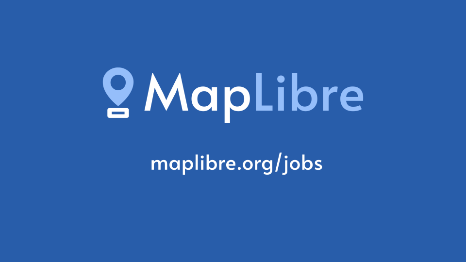

We thank all our sponsors for their generous financial support and assistance in building the MapLibre Organization.

We were successful in securing initial funding and would now like to pay people from the community for coordination, maintenance, and development work.

Go to [https://maplibre.org/jobs](https://maplibre.org/jobs), read more about the available roles, and apply now if you are interested in working on open-source mapping technology!

Our first paid coordinator is Oliver Wipfli who helped with organizational tasks in the past as a volunteer and did a great job.

We are looking forward to your application!
