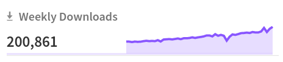
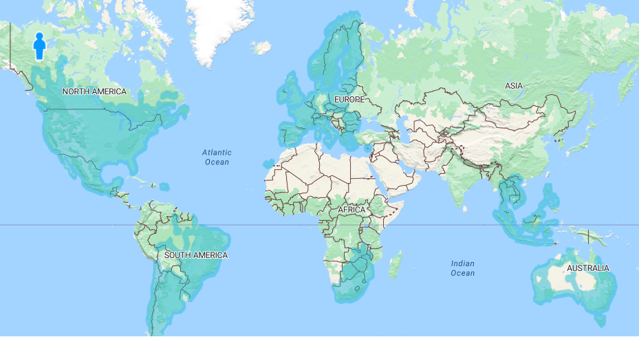

## Highlights

**Komoot** joined the MapLibre Sponsorship Program as a Silver Sponsor. Welcome komoot, we are glad to have you in the MapLibre community! Read the [news announcement...](https://maplibre.org/news/2023-04-06-komoot-becomes-a-maplibre-silver-sponsor/)

We released version 2.0.0 of the **Android Navigation** library. Big thanks to Robin Boldt and everyone who helped with this! Read the [news announcement...](https://maplibre.org/news/2023-03-27-android-navigation-version-2/)

The **Metal Project Team** has now officially started to work on the MapLibre Native migration from OpenGL to Metal on Apple devices. Steve Gifford wrote a [blog post](https://www.wetdogweather.com/blog/maplibre-upgrade) about the role of WetDogWeather in this migration. Our goal is to get a Metal Beta release out by the end of 2023. Read more about it in our [news announcement...](https://maplibre.org/news/2023-03-23-metal-project-team-started/)

MapLibre is happy to host a new repository: `flutter-maplibre-gl`! This project provides MapLibre bindings for Flutter. [flutter-maplibre-gl](https://github.com/maplibre/flutter-maplibre-gl)

Finally, MapLibre GL JS has hit 200k weekly downloads on [npm](https://www.npmjs.com/package/maplibre-gl) for the first time!

#### Bounty Program

The amounts allocated to [Bounty Directions](https://github.com/maplibre/maplibre/issues?q=is%3Aissue+is%3Aopen+label%3A%22bounty+direction%22) are pre-approved budgets. If an individual or a company would like to work on a Bounty Direction but requires more funding, they can make a request to the Governing Board to increase the budget of a Bounty Direction.

## MapLibre Native

People interested in contributing can schedule a call with Bart Louwers, Maintainer MapLibre Native: <a href="https://github.com/maplibre/maplibre-native/discussions/898">maplibre/maplibre-native#898</a>.

#### Bounties 💰

Have a look at all available [Bounties in MapLibre Native](https://github.com/maplibre/maplibre-native/issues?q=is%3Aissue+is%3Aopen+label%3A%22%F0%9F%92%B0+bounty+S%22%2C%22%F0%9F%92%B0+bounty+M%22%2C%22%F0%9F%92%B0+bounty+L%22%2C%22%F0%9F%92%B0+bounty+XL%22%2C%22%F0%9F%92%B0+bounty+XXL%22+) and feel free to propose Bounties yourself. Read our [step-by-step Bounties guide](http://localhost:45707/roadmap/step-by-step-bounties-guide/).

#### Contributions

Contributions since March 20th, 2023:

Most notable PRs:

- First bounty was finalised by Loc Nguyen: Getting Started Guide MapLibre Native for Android has now step by step guides and also a demo codebase [#808](https://github.com/maplibre/maplibre-native/issues/808)
- Thanks to Tadej Novak we have our first split repository initiative. We started with Qt platform [Qt platform](https://github.com/maplibre/maplibre-native-qt)
- OpenGL 2 support is dropped. For the ones that still want to use OpenGL 2 please refer to the [opengl-2](https://github.com/maplibre/maplibre-native/tree/opengl-2) branch.

### Rendering Modularization & Metal project

Project highlights since March 20th, 2023:

- Work was focused on shaders reorg and tests
- The <a href="https://github.com/orgs/maplibre/projects/8">Project Roadmap</a> is now available.
- Upgrade to OpenGL ES 3.0
  - Motivation, consequences:
    - Most Android devices are compatible with OpenGL ES 3.0
    - One platform that will suffer a drawback until the Metal backend will be implemented is macOS
    - A branch was created for OpenGL ES 2.0 support: [opengl-2](https://github.com/maplibre/maplibre-native/tree/opengl-2)

## MapLibre GL JS

#### Bounties 💰

Bounties completed since March 20th, 2023:

- Remove style-spec from the repo in favor of references to the npm package [Use @maplibre/maplibre-gl-style-spec in MapLibre GL JS](https://github.com/maplibre/maplibre-gl-js/issues/2194)
- Opacity fix for `setTerrain` by adding a warnonce when it detects that a user is using the same source for a hillshade and for 3D terrain [Opacity fix for setTerrain](https://github.com/maplibre/maplibre-gl-js/issues/2035)
- Add `queryTerrainElevation` allows getting terrain elevation in meters at specific point ([#2264](https://github.com/maplibre/maplibre-gl-js/pull/2264))

#### Contributions

Most notable PRs since March 20th, 2023:

- Yi Zhang (Microsoft) - Improve initial loading performance by lazy serializing layers only when needed. ([#2306](https://github.com/maplibre/maplibre-gl-js/pull/2306))
- Cuong Nguyen - Add `queryTerrainElevation` allows getting terrain elevation in meters at specific point ([#2264](https://github.com/maplibre/maplibre-gl-js/pull/2264))
- Karol Leśniak Improved the CSS4 color support ([#2376](https://github.com/maplibre/maplibre-gl-js/pull/2376))

## MapLibre Style Specification

The MapLibre Style Specification has been moved out of MapLibre GL JS and lives now in its own repository: [maplibre-style-spec](https://github.com/maplibre/maplibre-style-spec)

Big thanks to Birk Skyum for bringing up the new documentation website for the style spec at [MapLibre Style Spec](https://maplibre.org/maplibre-style-spec/)!

#### Debated design proposals:

- Support for `refreshTiles` per tile source [#61](https://github.com/maplibre/maplibre-style-spec/issues/61)
- Expanding `tileSources` bounds [#60](https://github.com/maplibre/maplibre-style-spec/issues/60)
- Add elevation to symbol layer [#62](https://github.com/maplibre/maplibre-style-spec/issues/62)
- Update `text-offset` to better support variable anchor placement [#112](https://github.com/maplibre/maplibre-style-spec/issues/112)

Since there are now two design proposals that expand the <a href="https://github.com/mapbox/tilejson-spec">TileJSON specification</a>, we plan to create a fork of TileJSON and maintain it in the MapLibre Organization.

<i>Some data sources like traffic have non-global coverage. To avoid loading empty tiles, we want to introduce more complex source tile bounds in the TileJSON specification.</i>
