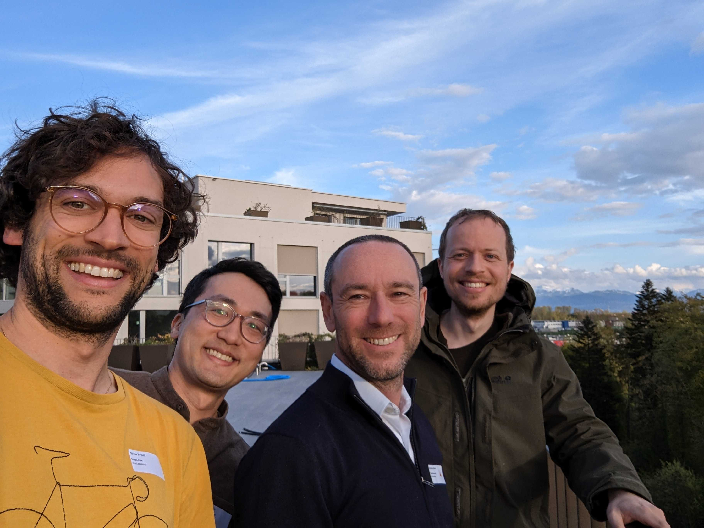

# MapLibre Newsletter - May 2023

## Highlights

We would like to thank our first sponsor [Mierune](https://www.mierune.co.jp/) for their continued trust in MapLibre.

Many real-world applications have been built with MapLibre. As suggested in https://github.com/maplibre/maplibre/discussions/242 it is about bringing the Community together. Implementing new ideas is what will make MapLibre thrive further. We want to recognize all of your efforts, collectively, and so decided to expand on the idea of the [MapLibre Innovation Lab](https://lab.maplibre.org/).

Left to right: Oliver Wipfli (MapLibre), Brandon Liu (Protomaps), Emmanuel Belo (CamptoCamp), Bart Louwers (MapLibre)

To engage with the Community in person, MapLibre was represented at the [OGC Code Sprint](https://www.linkedin.com/posts/camptocamp-sa_the-ogc-code-sprint-at-camptocamp-activity-7062726780234682368-9Dq_) in April. We mingled with fellow geospatial developers at the beautiful offices of the host [CamptoCamp](https://www.camptocamp.org/). We enjoyed a family-like gathering with Lake Geneva and its surrounding mountains only a stone's throw away. As of [MapLibre GL JS](https://github.com/maplibre/maplibre-gl-js), we tested a pitch-dependent field of view, which can be used to let 3D buildings 'pop out' as you change the pitch. Additionally, we experimented to make the depth buffer accessible for end users, which can be used to implement effects, such as fog, in the near future. Regarding [MapLibre Native](https://github.com/maplibre/maplibre-native), some work on CI was done: from now on, a bot leaves comments with a link of the results on PRs when render tests have run.

#### Bounty Programm 💰

We would like to remind you about our news in April:

"The amounts allocated to [Bounty Directions](https://github.com/maplibre/maplibre/issues?q=is%3Aissue+is%3Aopen+label%3A%22bounty+direction%22) are pre-approved budgets. If an individual or a company would like to work on a Bounty Direction but requires more funding, they can make a request to the Governing Board to increase the budget of a Bounty Direction."

In the upcoming days, you will find a step-by-step guide on what to hand in for a "Budget Increase" in our [wiki](https://github.com/maplibre/maplibre/wiki/Bounty-System).

## MapLibre GL JS

TBD

#### Contributions

Most notable contributions since April 14th, 2023:

TBD

## MapLibre Native

People interested in contributing can schedule a call with Bart Louwers, Maintainer MapLibre Native: <a href="https://github.com/maplibre/maplibre-native/discussions/898">maplibre/maplibre-native#898</a>.

#### Contributions

Most notable contributions since April 14th, 2023:

TBD

## Metal

Check up on weekly updates from now on [here](https://github.com/maplibre/maplibre-native/discussions/1072).

Highlights since April 14th, 2023:

## Events

TBD
