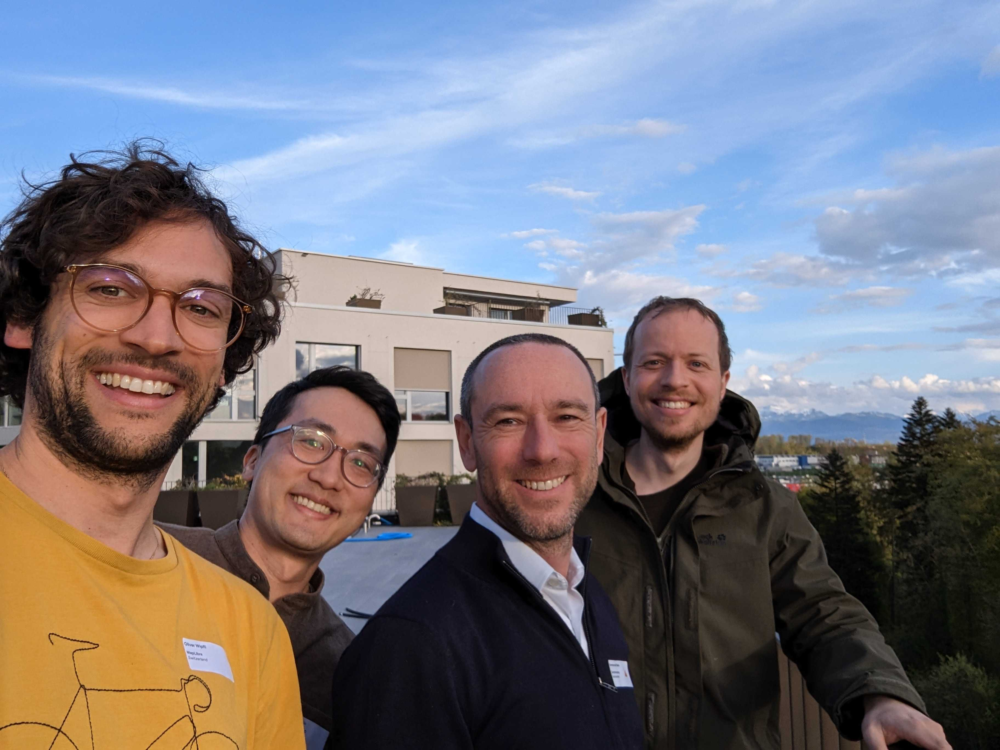

# MapLibre Newsletter - May 2023

## Highlights

#### Mierune

We would like to thank our first sponsor [Mierune](https://www.mierune.co.jp/) for their continued trust in MapLibre.

#### MapLibre Innovation Lab

Many real-world applications have been built with MapLibre. As suggested in https://github.com/maplibre/maplibre/discussions/242 it is about bringing the Community together. Implementing new ideas is what will make MapLibre thrive further. We want to recognize all of your efforts, collectively, and so decided to expand on the idea of the MapLibre Innovation Lab - stay tuned.

#### OGC Sprint

Left to right: Oliver Wipfli (MapLibre), Brandon Liu (Protomaps), Emmanuel Belo (CamptoCamp), Bart Louwers (MapLibre)

To engage with the Community in person, MapLibre was represented at the [OGC Code Sprint](https://www.linkedin.com/posts/camptocamp-sa_the-ogc-code-sprint-at-camptocamp-activity-7062726780234682368-9Dq_) in April. We mingled with fellow geospatial developers at the beautiful offices of the host [CamptoCamp](https://www.camptocamp.org/). We enjoyed a family-like gathering with Lake Geneva and its surrounding mountains only a stone's throw away. As of [MapLibre GL JS](https://github.com/maplibre/maplibre-gl-js), we tested a pitch-dependent field of view, which can be used to let 3D buildings 'pop out' as you change the pitch. Additionally, we experimented to make the depth buffer accessible for end users, which can be used to implement effects, such as fog, in the near future. Regarding [MapLibre Native](https://github.com/maplibre/maplibre-native), some work on CI was done: from now on, a bot leaves comments with a link of the results on PRs when render tests have run.

#### Bounty Program 💰

We would like to remind you about our news in April:

"The amounts allocated to [Bounty Directions](https://github.com/maplibre/maplibre/issues?q=is%3Aissue+is%3Aopen+label%3A%22bounty+direction%22) are pre-approved budgets. If an individual or a company would like to work on a Bounty Direction but requires more funding, they can make a request to the Governing Board to increase the budget of a Bounty Direction."

In the upcoming days, you will find a step-by-step guide on what to hand in for a "Budget Increase". On top of that, we are excited to add "Bounty Direction Suggestion". Again, both can be applied for by companies as well as individuals. All details can be found in our [wiki](https://github.com/maplibre/maplibre/wiki/Bounty-System). We are very much looking forward to your input.

## MapLibre GL JS

#### Bounties 💰

Bounties completed since April 14th, 2023:

- Replace [Playwright](https://github.com/microsoft/playwright) with [Puppeteer](https://github.com/puppeteer/puppeteer): [#2481](https://github.com/maplibre/maplibre-gl-js/issues/2481)
- Parallelize test workflow by splitting up jobs: [#2482](https://github.com/maplibre/maplibre-gl-js/issues/2482)
- Update WebGL types in vertex buffer and uniform binding: [#2515](https://github.com/maplibre/maplibre-gl-js/issues/2515)
- Split tests run to optimize CI run time: [#2411](https://github.com/maplibre/maplibre-gl-js/issues/2411)

Thanks [Birk](https://github.com/birkskyum) for the contributions!

#### Contributions

Most notable contributions since April 14th, 2023:

- Lazy load default style properties on demand to improve loading performance and reduce memory usage: [#2476](https://github.com/maplibre/maplibre-gl-js/pull/2476)
- Remove support for `hsl` CSS color in a format that does not comply with the CSS color specification. Colors defined in the following format **will no longer work**: `hsl(110, 0.7, 0.055)`. Instead **it is recommended** to use the percentage format: `hsl(110, 70%, 5.5%)`. See the PR: [#2376](https://github.com/maplibre/maplibre-gl-js/pull/2376)
- Remove "mapbox-gl-supported" package from API. If needed, please reference it directly instead of going through MapLibre: ([#2451](https://github.com/maplibre/maplibre-gl-js/pull/2451))
- Remove WebGL1 support: ([#2512](https://github.com/maplibre/maplibre-gl-js/pull/2512))

## MapLibre Native

People interested in contributing can schedule a call with Bart Louwers, Maintainer MapLibre Native: <a href="https://github.com/maplibre/maplibre-native/discussions/898">maplibre/maplibre-native#898</a>.

#### Contributions

Most notable contributions since April 14th, 2023:

- "maplibre-gl-native" became "maplibre-native": [#1090](https://github.com/maplibre/maplibre-native/pull/1090)
- Code format via clang-format was added: [#1086](https://github.com/maplibre/maplibre-native/pull/1086)
- Code coverage can now be checked [here](https://app.codecov.io/github/maplibre/maplibre-native/tree/main)
- Render tests are now running on Linux. The test results are uploaded and a bot posts a link to the results on a PR: [#1069](https://github.com/maplibre/maplibre-native/pull/1069)
- A size test was created for iOS. Similar as above, a bot will comment on each PR regarding the percentage size change of the library: [#1092](https://github.com/maplibre/maplibre-native/pull/1092)

## Metal

Check up on weekly updates from now on [here](https://github.com/maplibre/maplibre-native/discussions/1072) and follow the project roadmap [here](https://github.com/orgs/maplibre/projects/8).

Highlights since April 14th, 2023:

- Restructuring the code around drawables, builders and render loop
- Introducing [UBOs](https://www.khronos.org/opengl/wiki/Uniform_Buffer_Object)
- Refactoring layers starting with BackgroundLayer, FillLayer, CircleLayer and LineLayer

## Events

We would like to point out the [MapLibre User Group Japan](https://bit.ly/mug--jp) initiated by [Yasunori](https://github.com/dayjournal). The 5th event will take place [here](https://twitter.com/i/spaces/1nAJErzVBvgxL), June 14th, 2023 19:00 (JST). At the previous event 32 listeners participated when [MapLibre Native](https://github.com/maplibre/maplibre-native) was introduced. Another focus was [FOSS4G](https://2023.foss4g.org/). Anyone who is interested, please do not hesitate to join. Everyone is welcome.

## Next Up

You will find us at [SotMUS](https://2023.stateofthemap.us/schedule). [Yuri's](https://github.com/nyurik) topic June 9th 12:25pm (GMT-4) is: "MVT Tiles and Autonomous Driving, and other non-UI usage" with a Q&A, and June 10th 4:10pm (GMT-4): "MapLibre: a perfect map vis - are we there yet?". [Steve](https://github.com/sjg-wdw) will speak about the status and future of MapLibre Native June 10th 2:45pm (GMT-4).

We are looking forward to the preparations on the upcoming Governing Board Elections that will take place August 24th, 2023.

Thank you to all of you, you are the core of it.

Your MapLibre
