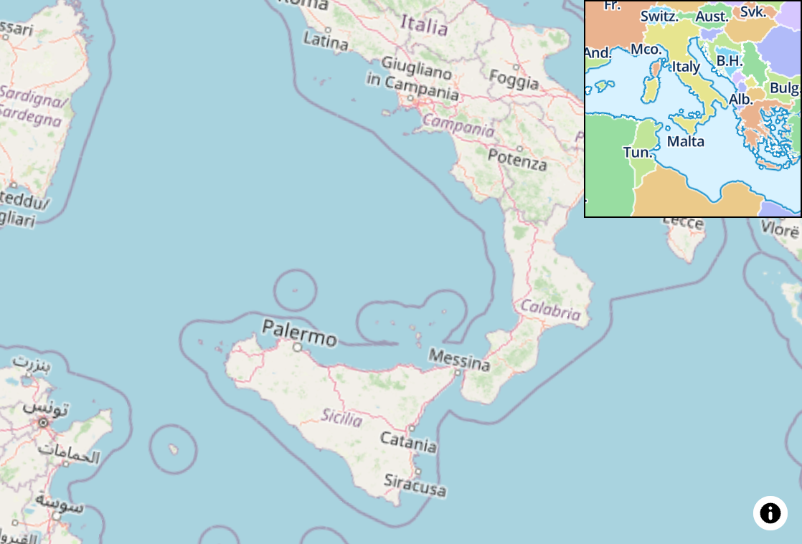
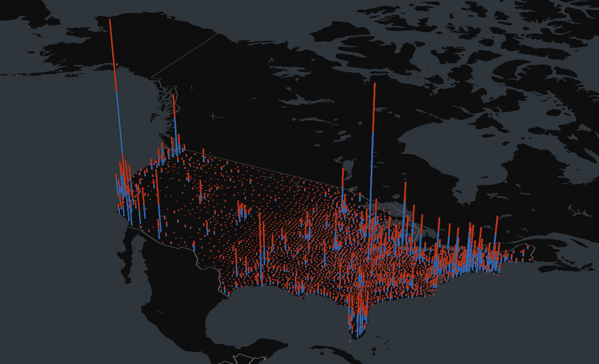
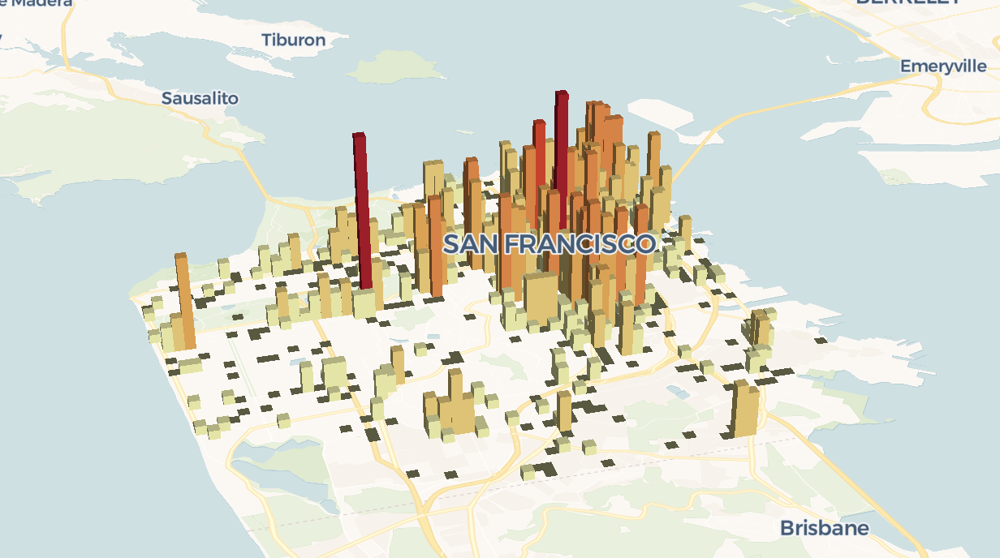
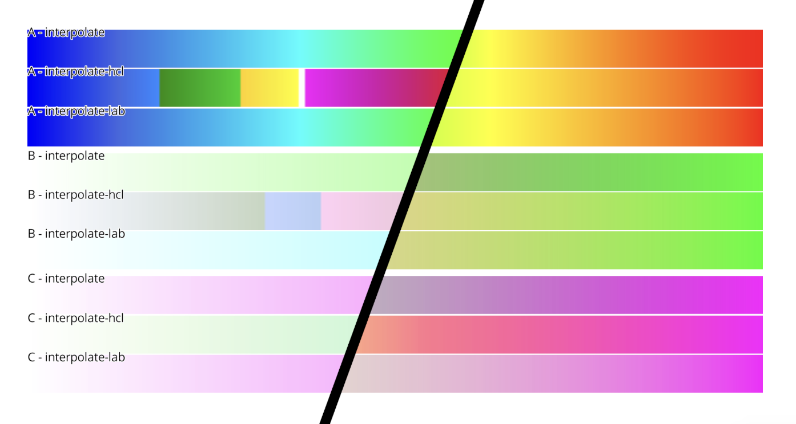

<meta name="twitter:card" content="summary_large_image">
<meta name="twitter:site" content="@maplibre">
<meta name="twitter:creator" content="@maplibre">
<meta name="twitter:title" content="MapLibre GL JS v3">
<meta name="twitter:description" content="New additions in MapLibre GL JS v3 includes a full transition to WebGL2, improvements to performance, fixes to the Terrain3D, CSS4 compliant colors, hooks for better camera control and more!">
<meta name="twitter:image" content="header.png">

This release is a big step for MapLibre GL JS! With more than 500 commits, and almost a year in the making, version 3.0.0 is surely our best release yet. Lots of features, performance improvement, bug fixes and a few potentially breaking changes that were necessary, to keep the project healthy, are to be found here.

**A note on migration:**
Most users will be able to update to v3 without code changes, but it's recommended to read the section on potentially breaking changes in the changelog carefully to assess if you're code needs migration.

Thanks for all the code contributions!

[@rotu](https://github.com/rotu), [@pramilk](https://github.com/pramilk), [@zhangyiatmicrosoft](https://github.com/zhangyiatmicrosoft), [@prozessor13](https://github.com/prozessor13), [@Pessimistress](https://github.com/Pessimistress), [@ChrisLoer](https://github.com/ChrisLoer), [@xabbu42](https://github.com/xabbu42), [@VehpuS](https://github.com/VehpuS), [@zstadler](https://github.com/zstadler), [@ZeLonewolf](https://github.com/ZeLonewolf), [@kajkal](https://github.com/kajkal), [@kevinschaul](https://github.com/kevinschaul), [@ambientlight](https://github.com/ambientlight), [@smellyshovel](https://github.com/smellyshovel), [@kircher1](https://github.com/kircher1), [@tordans](https://github.com/tordans), [@IvanSanchez](https://github.com/IvanSanchez), [@acalcutt](https://github.com/acalcutt), [@jleedev](https://github.com/jleedev), [@llambanna](https://github.com/llambanna), [@cns-solutions-admin](https://github.com/cns-solutions-admin), [@vanilla-lake](https://github.com/vanilla-lake), [@lukashass](https://github.com/lukashass)

Facilitated by:

[@HarelM](https://github.com/HarelM), [@BirkSkyum](https://github.com/BirkSkyum), [@wipfli](https://github.com/wipfli)

# Notable changes for this release

## Performance

A lot of work has been put into making this version of MapLibre GL JS faster. Here are some of the highlights:

- Lazy load default style properties on demand to improve loading performance and reduce memory usage. ([#2476](https://github.com/maplibre/maplibre-gl-js/pull/2476))
- Improve performance by sending style layers to the worker thread before processing it on the main thread to allow parallel processing ([#2131](https://github.com/maplibre/maplibre-gl-js/pull/2131))
- Improve performance when forcing full symbol placement by short-circuiting pause checks ([#2241](https://github.com/maplibre/maplibre-gl-js/pull/2241))
- Improve initial loading performance by lazy serializing layers only when needed. ([#2306](https://github.com/maplibre/maplibre-gl-js/pull/2306))
- Add validateStyle MapOption to allow disabling style validation for faster performance in a production environment. ([#2390](https://github.com/maplibre/maplibre-gl-js/pull/2390))
- Throttle the image request queue while the map is moving to improve performance ([#2097](https://github.com/maplibre/maplibre-gl-js/issues/2097))
- Improve control initial loading performance by forcing fadeDuration to 0 till the first idle event ([#2447](https://github.com/maplibre/maplibre-gl-js/pull/2447))
- Improve control performance by restricting worker count to a max of 1 except for Safari browser. ([#2354](https://github.com/maplibre/maplibre-gl-js/pull/2354))
- Bump KDBush and supercluster for better memory efficiency ([#2522](https://github.com/maplibre/maplibre-gl-js/pull/2522))
- Speed up the cross tile symbol index in certain circumstances ([#1755](https://github.com/maplibre/maplibre-gl-js/pull/1755))
- Improve rendering speed in scenes with many colliding symbolic icons and labels ([#1757](https://github.com/maplibre/maplibre-gl-js/pull/1757))
- Make request for ImageSource cancelable ([#1802](https://github.com/maplibre/maplibre-gl-js/pull/1802))
- Prevent unnecessary reload of raster sources when RTL Text Plugin loads ([#2380](https://github.com/maplibre/maplibre-gl-js/issues/2380))
- Fix event.isSourceLoaded to reflect the state of source loading for sourcedata event ([#2543](https://github.com/maplibre/maplibre-gl-js/pull/2543))

## transformCameraUpdate

This new feature makes it possible to get direct access to the camera transform, and manipulate it, continuously whenever the map is attempting to change it's viewport. It's a small hook, but it's very powerful. It's especially handy for reactive frameworks, where the camera state might be put in a store which can trigger side effects like listing the points of interest currently visible on the map. Another example of when it's relevant is when synching multiple maps, as exemplified with a demo of a minimap and a main map that drives each other here:

Sync two maps with the camera transform - [Minimap demo](https://stackblitz.com/edit/vitejs-vite-8nntze?file=src%2FMinimap.tsx)

  

## Terrain 3D

The terrain is becoming more stable, with a range of improvements landing in v3.

- Add queryTerrainElevation allows getting terrain elevation in meters at a specific point ([#2264](https://github.com/maplibre/maplibre-gl-js/pull/2264))
- Adding a `warnonce` when terrain and hillshade source are the same ([#2298](https://github.com/maplibre/maplibre-gl-js/pull/2298))
- Move terrain object from style.terrain to map.terrain ([#1628](https://github.com/maplibre/maplibre-gl-js/pull/1628))
- Fix the gap between terrain elevated tiles ([#1602](https://github.com/maplibre/maplibre-gl-js/issues/1602))
- Fix wrap coords in `getTerrain` when `fitBounds` across the AM ([#2155](https://github.com/maplibre/maplibre-gl-js/pull/2155))
- Fix `getElevation()` causing an uncaught error ([#1650](https://github.com/maplibre/maplibre-gl-js/issues/1650)).
- Add map.getCameraTargetElevation() ([#1558](https://github.com/maplibre/maplibre-gl-js/pull/1558))
- Add `freezeElevation` to `AnimationOptions` to allow smooth camera movement in 3D ([#1514](https://github.com/maplibre/maplibre-gl-js/pull/1514))
- Improve rendering of areas below sea level, and remove elevationOffset workaround ([#1578](https://github.com/maplibre/maplibre-gl-js/pull/1578))
- Fix overlapping of 3D building parts when 3D Terrain is activated ([#2513](https://github.com/maplibre/maplibre-gl-js/issues/2513))
- Show 3D buildings located below sea level when 3D Terrain is activated ([#2544](https://github.com/maplibre/maplibre-gl-js/issues/2544))

## WebGL2

WebGL2 has finally reached a level of browser support that allows us, and large projects like [Unity](https://forum.unity.com/threads/removing-support-for-gles2-and-webgl1-in-2023-1a.1360090/) to embrace it fully. While WebGL2 is mostly backward compatible, it gives us lots of new features, and opportunities to improve performance through parallelization. It also removes the friction that exists when using MapLibre GL JS with libraries in the ecosystem that has moved to WebGL2 already - two examples of which can be seen in the demos below:

**Interleaved rendering of DeckGL attribute transitions**

3.0.0 - [Animating](https://codepen.io/birkskyum-1471370946/pen/VwEBPYW) - Uses WebGL2

2.4.0 - [Not animating](https://codepen.io/birkskyum-1471370946/pen/qBJyRdR)

  

**Interleaved rendering of DeckGL GPU accelerated GridLayer**

3.0.0 [GPU Accelerated](https://stackblitz.com/edit/vitejs-vite-asczxg?file=package.json) - Uses WebGL2

2.4.0 [Breaks](https://stackblitz.com/edit/vitejs-vite-9scpcz?file=package.json) - Browser console prints "Browser not supported"

  

## Color spaces

We now align better with the CSS Spec for color spaces, by using the D50 illuminant instead of the D65. This brings us more continuous color spaces with the `interpolate-hcl`. To see what that means in practice, the demo [here](https://kajkal.github.io/maplibre-gl-style-spec-color-demo/swipe.html) is a visualization of the color spaces. You can i.e. select 3.0.0-pre.4 and 3.0.0-pre.5, which is when the addition was made, and move the cursor up and down to compare them.

# Changelog

See a full changelog [here](https://github.com/maplibre/maplibre-gl-js/blob/main/CHANGELOG.md#300), including the list of potentially breaking changes.
