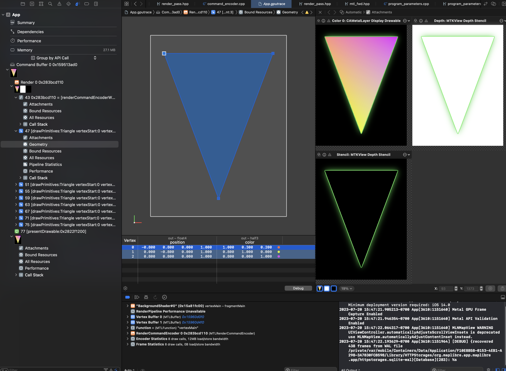

# MapLibre Newsletter - July 2023

## Highlights

### Harfbuzz

Harfbuzz has been introduced to render complex text. Check out the demo [here](https://github.com/maplibre/maplibre-native/pull/1289).

We want to emphasize [Markus Tremmel's](https://github.com/mactrem) input of prototyping new vector tile formats. Find his own words [here](https://github.com/mactrem/cov-tiles/discussions/6).

## MapLibre Native

### Renderer Modularization PRs

The new Modularized renderer architecture based on Drawables is being merged. The `topic/drawable` will be merged into `topic/drawable-reviewed`. The last improvement and fixes will be made on this branch, and then we will merge the changes into `main`. The legacy renderer pass will remain active until the Drawable renderer pass is stable enough. At that point, we will flip the switch and eventually the legacy renderer code will be removed. If you are interested in following along or make code reviews, please see an overview of the relevant PRs here: maplibre/maplibre-native#1389

- [Original Design Proposal](https://github.com/maplibre/maplibre-native/blob/main/design-proposals/2022-10-27-rendering-modularization.md)
- [MapLibre Phase 1 Design: Results](https://docs.google.com/document/d/1QtsUgDyD-Rt1McvJFz7HbHvEKli3tRVfxdW7fLDF-g8/edit#heading=h.dwpgby211stb)

### iOS

Alex Polvi contributed an [iOS getting started guide](https://github.com/maplibre/maplibre-native/blob/main/platform/ios/README.md), both for end-users of the library and those wanting to work on the library directly. It is now again possible to make developer builds of the test app for people that do not have a paid Apple Developer subscription. Thanks Alex!

As mentioned during the Technical Steering Committee this month, we now exclusively use Bazel for iOS build and Xcode configuration. Thanks to this it is possible to 'flatten' the confusing macOS and iOS directory structure. Marc Wilson is preparing a [PR](https://github.com/maplibre/maplibre-native/pull/1393) for this

We are now running an iOS render test on an a real iOS device for every PR. Thanks to the credits we have from AWS this is possible. You should be greeted with a green checkmark from your friendly MapLibre Native Bot when making a PR:

### Android

The design proposal from Fynn Godau to [overhaul the Annotations API on Android](https://github.com/maplibre/maplibre-native/blob/main/design-proposals/2023-06-17-android-annotations.md) has been merged.

### Metal

Work on the Metal rendering backend has started, and the first important steps have been completed. The first one being: drawing nothing with Metal. And the second one being: drawing a triangle with Metal!

(Screenshot from Tim Sylvester showing a triangle rendered with Metal.)

## MapLibre GL JS

TBD

## Events

TBD

## Next Up

The Governing Board Elections 2023 are taking place in August 24th, 2023. For those interested, please follow [this issue](https://github.com/maplibre/maplibre/issues/298) for all relevant news.
