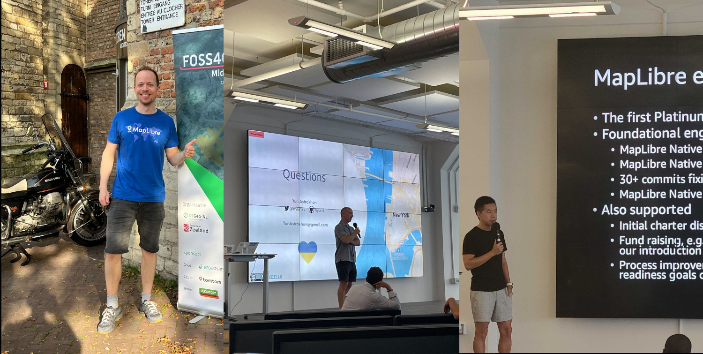

# MapLibre Newsletter - September 2023

### Governing Board Elections

It is already one year now that MapLibre has an elected Governing Board, and as the Board members serve a one-year-term, it was time for new Governing Board Elections. We held the Elections and all existing Board members have been re-elected. Read more [here](https://maplibre.org/news/2023-08-30-results-governing-board-election/).

### FOSS4G NL and Open Visualization Collaborator Summit

MapLibre was represented at two events in the last month:

- Bart Louwers, Maintainer Native, gave a talk at [FOSS4G NL](https://foss4g.nl/) in Middelburg
- Yuri Astrakhan, MapLibre Governing Board Member, and Haowen You, Engineering Manager at AWS, gave talks at the [Open Visualization Collaborator Summit](https://deck.gl/events/new-york-summit-2023/) in New York City.

Thank you all for promoting MapLibre at these events!

<i>From left to right: Bart Louwers at FOSS4G NL, Yuri Astrakhan and Haowen You at the Open Visualization Collaborator Summit.</i>

### Engineering Proposals by Wet Dog Weather

Wet Dog Weather, the engineering contractor of AWS that led the Metal migration in MapLibre Native, has filed a series of engineering proposals, see [here](https://github.com/maplibre/maplibre/discussions?discussions_q=is%3Aopen+author%3Asjg-wdw+).

The proposals include things like **Terrain 3D**, **Globe View**, and many other exciting features for MapLibre Native. If your company is interested in these features, get in touch with Steve Gifford, CEO of Wet Dog Weather, to discuss funding opportunities. You find him in the [MapLibre Slack channel](https://slack.openstreetmap.us/).

## MapLibre Style Specification

Last month, several design proposals have been opened in the [MapLibre Style Spec repo on GitHub](https://github.com/maplibre/maplibre-style-spec). Here is an overview:

- Add a `pitch` style spec expression similar to the `zoom` expression. [#346](https://github.com/maplibre/maplibre-style-spec/issues/346).
- Support arbitrary base and interval values in RasterDEM sources [#326](https://github.com/maplibre/maplibre-style-spec/issues/326).
- Change default value for text-font to Noto Sans Regular [#311](https://github.com/maplibre/maplibre-style-spec/issues/311)

Furthermore, there is an ongoing discussion about how to support more writing systems such as Indic scripts with Harfbuzz text shaping. Read more [here](https://github.com/maplibre/maplibre-style-spec/discussions/312).

## MapLibre Native

### Add subtitle...

## MapLibre GL JS

We've released version 3.3.1 with a few minor bug fixes related to typings and improved license.txt file handling for packaging tools.

## Upcoming Events

### State of the Map Europe

MapLibre will be represented by [Bart Louwers](https://github.com/louwers) and [Luke Seelenbinder](https://github.com/lseelenbinder) at [State of the Map Europe](https://stateofthemap.eu/) in [Antwerp](https://www.openstreetmap.org/search?query=Filip%20Williotstraat%209%2C%202600%20Antwerpen%2C%20Belgien#map=19/51.18690/4.43596) November 10-12th, 2023.

### FOSS4G (Seoul)

For late November, [Jashanpreet Singh](https://github.com/jashanbhullar) plans to hold a talk on the state of Maplibre at [FOSS4G in Seoul](https://foss4g.asia/2023/).

Come by and get to know us in person.

### MapLibre Meetup Japan

The MapLibre User Group Japan will organize an in-person meetup in November. If you are interested in joining the meetup in Japan, contact Yasunori Kirimoto in the [MapLibre Slack channel](https://slack.openstreetmap.us/). They even have MapLibre t-shirts!

### MapLibre Online Conference Day

We plan to do an online conference day. The date is still to be defined, but if you are interested in giving a talk, you can fill out the following form already now: [https://forms.gle/AKg63TnASSWXfZi66](https://forms.gle/AKg63TnASSWXfZi66) 

More info on the conference day will follow in the MapLibre Slack channel, on social media, and here in the Newsletter.
