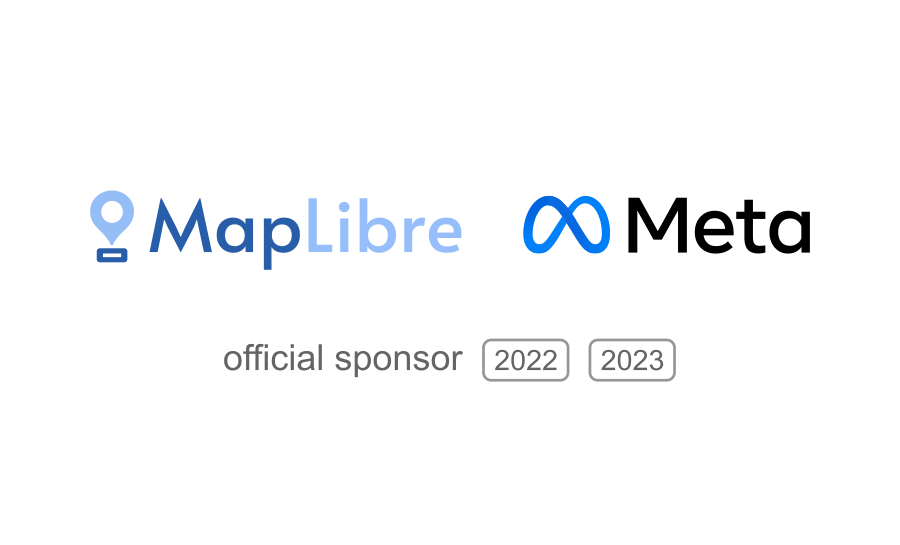

Meta continues to support MapLibre and increases its donation from the Silver to the Gold tier in its second year of sponsorship.

 
 

The Gold tier donation of USD 150,000 will be used to 25 percent for development of new features and to 75 percent for general maintenance of the MapLibre codebases and project coordination.

But not only is Meta supporting MapLibre financially. In 2023, Meta contributed a substantial amount of engineering time to the Metal project team in MapLibre Native. The fact that today we have a working early-access prerelease for Metal is in large part thanks to the excellence, team play, and graphics expertise that Meta provided.

Meta is also supporting a range of other geospatial open-source projects, see <a href="https://maps.atmeta.com/">https://maps.atmeta.com/</a>.

We thank everyone at Meta for your trust, your contributions, and for the generous Gold sponsorship!

It is great to collaborate with such amazing people and we are looking forward to a productive future.
