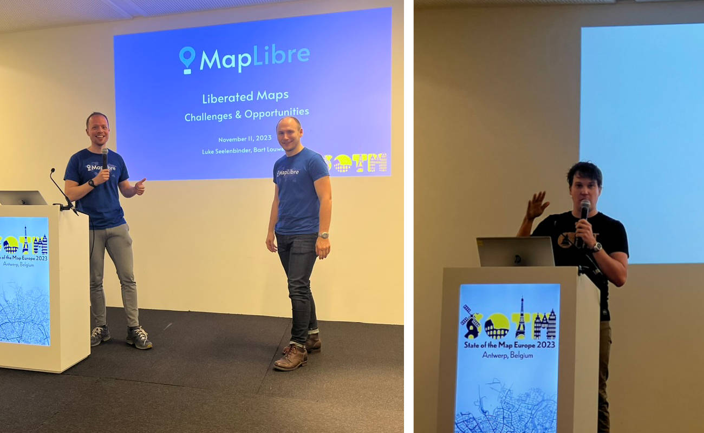

# MapLibre Newsletter - November 2023

## MapLibre GL JS

### v4

Versions 3.5.2, 3.6.0, 3.6.1 were released, and we started going into the pre-release mode for MapLibre GL JS v4. The most significant breaking change in version 4 will be the replacement of outdated JavaScript callbacks with Promises in several public APIs.

You can now start testing the version 4 pre-releases at https://github.com/maplibre/maplibre-gl-js/releases. Your feedback and bug reports are more than welcome!

### Globe

Not just one, but actually two proof-of-concepts for a globe view were shared by two independent developers this month. See https://github.com/maplibre/maplibre/discussions/161.

We are excited to see where this will bring us!

 

<i>Globe view proof-of-concept by Vivan Larrieu. Link: https://pheonor.github.io/globe-demo/.</i>

## MapLibre Native

### Metal Project

The Metal project is now in its final stage. A big push was made this month to get the render tests to a 100% success rate again with the new Metal based renderer. Check out [this PR](https://github.com/maplibre/maplibre-native/pull/1855) for an overview of the changes that were needed. Interestingly, aside from a handful of exceptions, the team got the Metal renderer to conform to OpenGL renderer without adjusting the acceptable pixel difference threshold or generating a new set of expected images.

The target of at most 5% binary size increase will be hit after the [shader tooling overhaul](https://github.com/maplibre/maplibre-native/pull/1848) PR is merged.

Another current focus is performance. While frame times on iOS were comparable to the legacy renderer with a non-moving map, benchmarking with a moving map (doing a tour) revealed performance degradations especially on symbol-heavy maps ([iOS results](https://github.com/maplibre/maplibre-native/pull/1873#issuecomment-1820845760), [Android benchmark](https://github.com/maplibre/maplibre-native/pull/1850)). The plan is to investigate these findings and fix the found bottlenecks. Work is underway to run these benchmarks on CI to track progress and prevent regressions.

With regards to stability of the Metal rendering backend, no crashes have been reported on the [pre-release issue](https://github.com/maplibre/maplibre-native/issues/1609). More conclusive results on stability require testing on a wide variety of devices and as a part of real applications. Such results are expected early next year, when big users will start an A/B rollout of the new renderer.

Re-enabling macOS support using the Metal renderer (native macOS, Qt, Node.js) will be one of the last topics to be addressed as part of the Metal project.

### Other Developments

- Tadej Novak has made a lot of progress with the [MapLibre Native Qt repo](https://github.com/maplibre/maplibre-native-qt). In the future, the Qt platform will live in this repository instead of the main repository.

- [Multi-sprites support for MapLibre Native](https://github.com/maplibre/maplibre-native/pull/1858) is expected to land soon. More information about this feature can be found in the [MapLibre Style Spec documentation](https://maplibre.org/maplibre-style-spec/sprite/).

- Two design proposals were accepted this month:
  - [Complex, Animatable, Interactive Annotations Proposal](https://github.com/maplibre/maplibre-native/blob/main/design-proposals/2023-11-08-complex-animatable-interactive-annotations.md)
  - [Ambient cache initialization speed improvement](https://github.com/maplibre/maplibre-native/blob/main/design-proposals/2023-11-06-ambient-cache-initialization-speed-improvement.md)

## Martin

Martin tile server now has a tool similar to `tilelive-copy` and `tippecanoe` to bulk copy tiles in bulk from any source supported by the Martin tile server, using the same source configuration system/CLI parameters, but without starting up the whole tile server in order to generate them. Available as a standalone binary with no external dependencies.

Use case: generate several areas of the map from PostgreSQL tables/functions or other sources, and even merge multiple tile layers together into a single .mbtiles tileset file.

In other news, `mbtiles summary` tool can now print in-depth details about an mbtiles file such as per-zoom statistics.

See https://github.com/maplibre/martin/releases/tag/v0.11.0

## Past Events

## State of the Map Europe 2023

[State of the Map Europe](https://stateofthemap.eu/) was held the 10-12th of November, 2023 in Antwerp. [Luke Seelenbinder](https://maplibre.org/about/luke/) and [Bart Louwers](https://maplibre.org/about/bart/) represented the MapLibre team at the event and gave a talk to spread the word about MapLibre.

Jonas Vautherin presented a talk about [Ramani Maps](https://github.com/ramani-maps/ramani-maps), a plugin for MapLibre Native that wraps the core Android library, allowing a declarative syntax with Jetpack Compose.

 
 

<i>SotM EU speakers. From left to right: Bart Louwers, Luke Seelenbinder, Jonas Vautherin.</i>

We thank the organizers of SotM EU for organizing a great event and for bringing the open data and open source geospatial communities together!

## Upcoming Events

### Maptime Meetup

Some members of the MapLibre Community will participate in the Maptime Meetup at the TomTom office in Amsterdam on December 15th, 2023. [Read more...](https://www.meetup.com/maptime-ams/events/297537707/?isFirstPublish=true)
