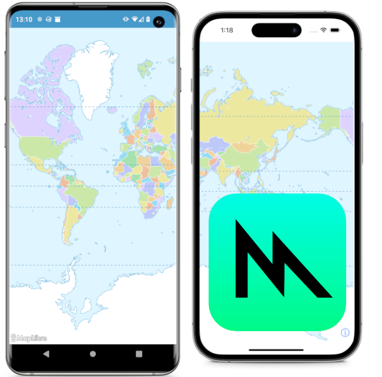

We are excited to announce the release of MapLibre Native for iOS v6.0.0 with Metal support!

 
 

[MapLibre Native](https://github.com/maplibre/maplibre-native) is a map rendering toolkit written in C++ that can be used on many different [platforms](https://github.com/maplibre/maplibre-native?tab=readme-ov-file#platforms). For GPU accelerated real-time rendering, MapLibre Native traditionally relied only on the industry standard graphics API called OpenGL ES. However, in 2018 Apple announced that it would be phasing out OpenGL ES on all Apple platforms in favor of [Metal](https://en.wikipedia.org/wiki/Metal_(API)). This put MapLibre at risk of being unusable on Apple devices in the case that OpenGL ES support should be discontinued. With the new Metal rendering backend we are no longer exposed to this risk and users will benefit from the advantages of a state-of-the-art graphics framework.

Building a Metal rendering backend was a monumental engineering effort, well over a year in the making. Credit goes to the graphics engineers of the “Metal team” led by Steve Gifford consisting of Alex Cristici, Marc Wilson, Stefan Karschti and Tim Sylvester.

The work has been sponsored by AWS and Meta. We would like to extend a big Thank You to  Haowen You from AWS and Marc Regan from Meta for coordinating this collaboration. Metal has been the biggest engineering initiative that MapLibre has seen so far and that we were able to realize this as an industry collaboration makes us even more happy!

## Try It Out Today!

If you develop for iOS, the new v6.0.0 release is available on [GitHub](https://github.com/maplibre/maplibre-native/releases/tag/ios-v6.0.0), CocoaPods and the [Swift Package Index](https://swiftpackageindex.com/maplibre/maplibre-gl-native-distribution).
