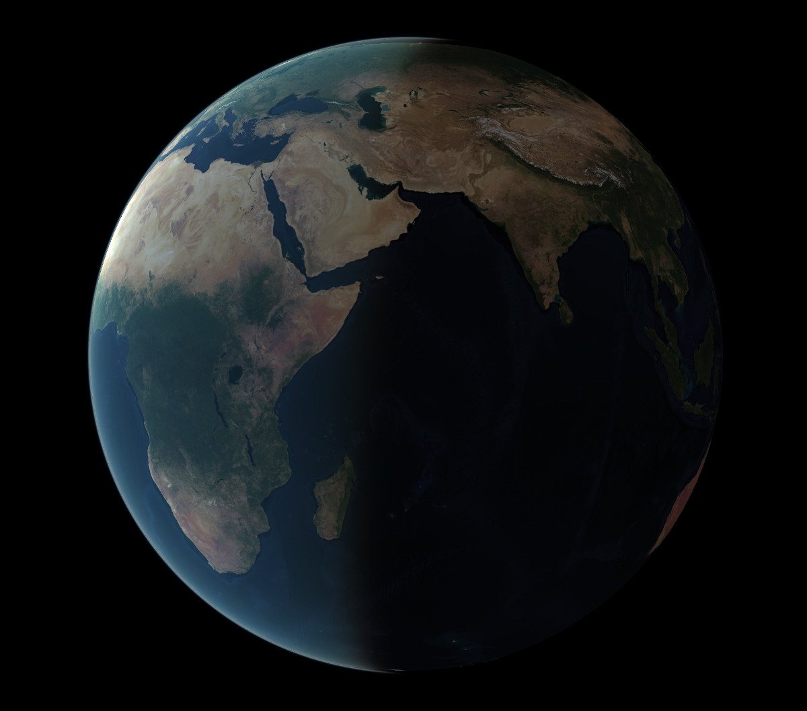

At the end of March, we were happy to announce that Mappedin, a global leader in indoor mapping and spatial data management, joined the MapLibre Sponsorship Program. Let us give a warm welcome to our latest sponsor Mappedin!

 
 

In addition to the usual monthly meetings for MapLibre GL JS and MapLibre Native, we now also have a monthly call to talk about **MapLibre Navigation** (thanks Ian Wagner for the initiative!). As always, the monthly calls take place on the second Wednesday of the month. You find the zoom links in our [slack channel](https://slack.openstreetmap.us/) and the next dates are:

- MapLibre Navigation, Wed May 8th, 2024, 6 to 7 PM CEST
- MapLibre Native, Wed May 8th, 2024, 7 to 8 PM CEST
- MapLibre GL JS, Wed May 8th, 2024, 8 to 9 PM CEST

## MapLibre GL JS

MapLibre GL JS versions [4.1.2](https://github.com/maplibre/maplibre-gl-js/releases/tag/v4.1.2) and [4.1.3](https://github.com/maplibre/maplibre-gl-js/releases/tag/v4.1.3) were released this month.

We have recently merged a [text fit feature](https://github.com/maplibre/maplibre-gl-js/pull/4019) by Microsoft that allows keeping the aspect ratio of an image in some cases constant. Shields are the main motivation for this feature, which will be available in the next release.

The globe branch is progressing nicely with the addition of fill-extrusion, hillshade and lines.

Atmosphere is in discussion in terms of spec, and has an initial implementation that looks really awesome!

 
 

<i>A MapLibre raster tile globe with an atmosphere layer. See [source code](https://github.com/maplibre/maplibre-gl-js/pull/4020).</i>

## MapLibre Style Spec

The style spec docs were rewritten to use the awesome [Material for MkDocs](https://squidfunk.github.io/mkdocs-material/), which allows search and easy maintenance.

While the spec is not changing rapidly as we invest a lot of effort to keep it future-ready on one hand and backward-compatible on the other, making sure the docs are helpful is one of the most important aspects. This is vital so the community will be able to use it, and enjoy it.

We are looking for more expression examples in order to enrich the docs. This is probably the most complicated part of the spec, and we believe examples are very important to understand how things work.

The [sky spec discussion](https://github.com/maplibre/maplibre-style-spec/issues/163) has started looking at the atmosphere definitions as part of it, and there is a [projection discussion](https://github.com/maplibre/maplibre-style-spec/issues/568) for the globe.

A new type of source was [proposed and approved](https://github.com/maplibre/maplibre-style-spec/issues/583): `contour`. This is the first time in a very long time a new type of source was approved! Very exciting!!

Feel free to join the discussions about the future of MapLibre!

## MapLibre Native

The long awaited Android 11.0.0 release is around the corner! Last-minute blocking issues can be reported in the [pre-release thread](https://github.com/maplibre/maplibre-native/issues/1608). Several issues have been addressed this month (e.g. [#2296](https://github.com/maplibre/maplibre-native/issues/2296)). We have a [milestone](https://github.com/maplibre/maplibre-native/milestone/16) with currently one to-be-resolved issue before we will push out the Android 11.0.0 release. Thanks to everyone that helped with testing!

MapLibre Native is being deployed in larger settings and several crashes have been [reported](https://github.com/maplibre/maplibre-native/issues?q=is%3Aissue+is%3Aopen+crash+created%3A%3E%3D2024-04-01+label%3Abug) this month. We now include debug symbols for iOS and Android in every release. If you encounter a crash, you can symbolicate the crash report to more easily identify where the issue occurred.

A (wide vector) shader was successfully transplanted from another mapping toolkit ([#2183](https://github.com/maplibre/maplibre-native/pull/2183)). We want to make it possible to extend MapLibre Native. As seen in the PR, we're not quite at the point where you can do this without changing internals, but it's becoming easier.

Metal-cpp comes with its own smart pointers. We were using them inappropriately in a few places, resulting in a memory leak. Resolved by [#2254](https://github.com/maplibre/maplibre-native/pull/2254) and [#2257](https://github.com/maplibre/maplibre-native/pull/2257).

We now go through the entire iOS test app in an UI test to make sure nothing crashes as a smoke test ([#2258](https://github.com/maplibre/maplibre-native/pull/2258)). We also run that UI test with an undefined-behavior sanitizer on CI ([#2280](https://github.com/maplibre/maplibre-native/pull/2280)).

Some uniform buffer objects were moved to the global level, others to the layer level, resulting in fewer binds ([#2266](https://github.com/maplibre/maplibre-native/pull/2266) and [#2247](https://github.com/maplibre/maplibre-native/pull/2247) and [#2292](https://github.com/maplibre/maplibre-native/pull/2292)).

Allow changing User-Agent on iOS [#2293](https://github.com/maplibre/maplibre-native/pull/2293). This was the first pull request from [@hactar](https://github.com/hactar). 💪

MapLibre Native for Node.js 5.4.0 was [released](https://github.com/maplibre/maplibre-native/releases/tag/node-v5.4.0).

## MapLibre Navigation iOS

We are currently reviving [maplibre-navigation-ios](https://github.com/maplibre/maplibre-navigation-ios). After having improved [maplibre-navigation-android](https://github.com/maplibre/maplibre-navigation-android) recently, we are now doing the same for iOS.

- We have updated dependencies like maplibre-native to version 6 with Metal support.
- We use SPM instead of CocoaPods for dependency management.
- We have added hooks to make customizing some of the navigation functions possible.

Robin Boldt who works for Kurviger, a motorcycle app, and is one of the main maintainers of MapLibre Navigation for iOS, is currently beta-testing with maplibre-navigation-ios. He invites you to give the app a spin [here](https://testflight.apple.com/join/Y2eMnS3D).

In the future we also want to make it easier to customize the out of the box navigation UI and to move the Android and iOS navigation libraries closer together.

Would you like to join the effort? PRs and contributions are welcome. And join our MapLibre Navigation meeting in May!
