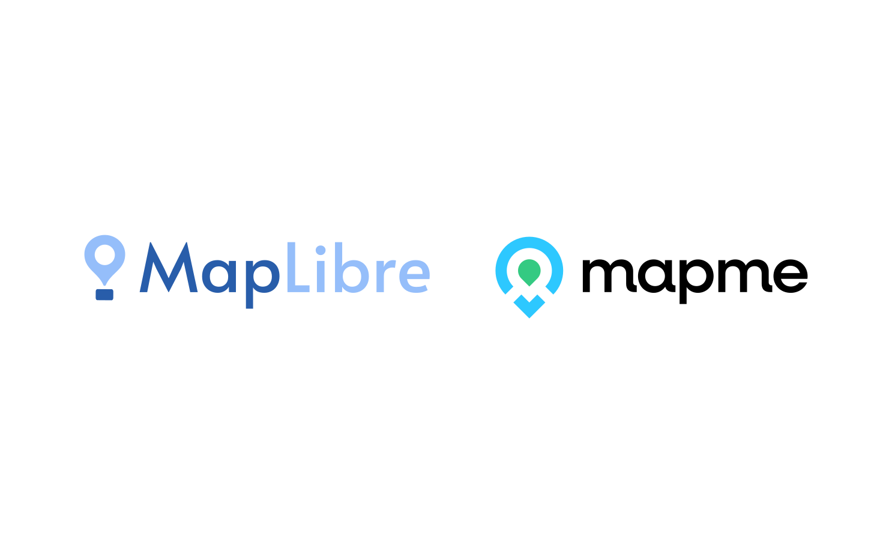

Mapme joins the MapLibre Sponsorship Program as a Silver Sponsor.

 
 

The Silver tier [donation](https://opencollective.com/maplibre/contributions/771444) of USD 10,000 will be used for general maintenance of the MapLibre codebases and project coordination.

<a href="https://mapme.com/">Mapme</a> is the versatile tool for creating interactive maps with no coding required. MapLibre is a core component of Mapme's user-friendly platform, empowering organizations and businesses across various industries – including non-profits, cities, real estate, education, travel, and culture – to build and share stunning interactive maps. This sponsorship demonstrates Mapme's commitment to fostering innovation within the open-source mapping community.

By leveraging MapLibre's powerful functionalities, even non-developers can create impactful and engaging interactive maps. This, in turn, allows thousands of non-profit organizations and companies to benefit from the flexibility and high performance of the MapLibre library.

<a href="https://mapme.com/mapme-free-trial/">Mapme offers a free trial</a> as well as generous discounts to NGOs, charities, and community organizations, and for student projects.

We are proud to have Mapme as a sponsor and look forward to a long-term partnership!
