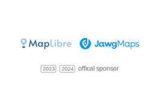

# MapLibre Newsletter - July 2024

[Jawg Maps](https://www.jawg.io/en/) continues to support MapLibre in 2024 - Thank You!

 
 

## MapLibre Governing Board Election

The [MapLibre Governing Board 2024](https://github.com/maplibre/maplibre/issues/374) election will take place on Thursday, August 29th, 2024. The Governing Board consists of 5 members which get elected by the MapLibre Voting Members. The primary role of the Board is to set the long-term strategy of MapLibre, overview MapLibre's finances, communicate with sponsors, and oversee MapLibre's team members. Under normal circumstances, the Governing Board does not engage in technical decisions in the MapLibre codebases. However, should there be an otherwise unresolvable conflict, the Board will have the last word and serves as a last instance in case of a dispute. The Governing Board has quarterly internal meetings as well as quarterly meetings with sponsors.

There are no restrictions on being a Board member and we welcome all candidacies. If you are interested in serving on the Board, please [register as a candidate](https://github.com/maplibre/maplibre/discussions/375).

The MapLibre Voting Members are the people who elect the MapLibre Governing Board. They can also vote on changes to the [MapLibre Charter](https://github.com/maplibre/maplibre/blob/main/CHARTER.md). Like every year, we are inviting more people to the group of MapLibre Voting Members before the 2024 election. This is a great opportunity to look back at what happened last year and thank important contributors and donors of MapLibre. Existing Voting Members can nominate new Voting Members, read more [here](https://github.com/maplibre/maplibre/issues/376).

We will again use the email voting system OpaVote for the Governing Board election. Sometimes the OpaVote emails can end up in the spam folder. If you are a Voting Member, it might make sense to explicitly allow emails from noreply@opavote.com as a preparation.

## MapLibre GL JS

The main focus of this month was to push forward the globe view. A lot of effort went into the globe controls, gestures, and refactoring the transform class to be different between the globe and Mercator view. This is the final stretch for the globe and we are aiming to release it by the end of this year.

We would like to repeat here our gratitude to Jakub Pelc for his amazing work on the globe implementation!

While the changes in globe are not considered breaking changes of the public API, the direction right now is to nevertheless bump the major version and release the globe view feature in MapLibre GL JS v5. This is to avoid unexpected breaking changes in plugins and other external libraries that might expect certain behavior from the internal implementation such as the transform class.

## MapLibre Native

The initial [Vulkan backend](https://github.com/maplibre/maplibre-native/pull/2564) implementation is almost ready to merge! In one month it went from being a proof-of-concept to passing all render tests. We don't have any performance numbers at this point, and it is probably too early for those anyway. To fully exploit the capabilities of Vulkan and use it to tune performance we may need to make some architectural challenges to the renderer. We also still need to figure out how to integrate it with Android and how to distribute it for that platform. Of course, OpenGL ES will still be supported as well. That said, impressive and promising progress was made this month.

Leveraging Qt for WebAssembly, we've managed to create a WebGL1 build of MapLibre Native with a [functional demo](https://maplibre-native-wasm-dist.pages.dev/qt-opengl2/). More info on this demo can found [in this issue](https://github.com/maplibre/maplibre-native-qt/issues/49#issuecomment-2253599308). This is an early stage, and we're working in multiple directions, an overview of which can be found [here](https://github.com/birkskyum/maplibre-native-wasm)). Stay tuned for updates in this area, and be sure to get involved if using MapLibre Native on the web interests you.

Some new articles have been added to the new iOS documentation, including information on the [snapshotter](https://maplibre.org/maplibre-native/ios/latest/documentation/maplibre-native-for-ios/staticsnapshotexample), [customizing fonts](https://maplibre.org/maplibre-native/ios/latest/documentation/maplibre-native-for-ios/customizing_fonts), [Info.plist keys](https://maplibre.org/maplibre-native/ios/latest/documentation/maplibre-native-for-ios/info.plist_keys), [user interactions](https://maplibre.org/maplibre-native/ios/latest/documentation/maplibre-native-for-ios/gesturerecognizers), [adding multiple images](https://maplibre.org/maplibre-native/ios/latest/documentation/maplibre-native-for-ios/multipleimagesexample) and [offline](https://maplibre.org/maplibre-native/ios/latest/documentation/maplibre-native-for-ios/offlinepackexample) [capabilities](https://maplibre.org/maplibre-native/ios/latest/documentation/maplibre-native-for-ios/manageofflineregionsexample).

[Compose Multiplatform](https://www.jetbrains.com/lp/compose-multiplatform/) is a cross-platform UI software development kit from Jetbrains (somewhat similar to Flutter, but using Kotlin instead of Dart). There is some interest from the community to develop a MapLibre Native library for Compose Multiplatform (not to be confused for Jetpack Compose, for which libraries already exist). Please see the [issue](https://github.com/maplibre/maplibre-native/issues/2638) for a discussion.

Some improvements were made to the included [Dockerfile](https://github.com/maplibre/maplibre-native/tree/main/docker) and accompanying instructions to make Linux builds of MapLibre Native.

A Pull Request showing a [proof-of-concept](https://github.com/maplibre/maplibre-native/pull/2647) that integrates Rust build tools into the CMake build config was opened this month. The PR swaps out [cppcolorparser](https://github.com/maplibre/maplibre-native/blob/main/vendor/csscolorparser/csscolorparser.cpp) with a similar Rust library, just to see if a Rust dependency can be added while still building and running. It does build, and it does run. If successful, this will allow MapLibre Native to gain safety, speed, and stability of Rust components, while keeping existing functionality and API for our users.

Furthermore:

- We now run the C++ Unit Tests on Android as part of CI.
- [MapLibre Android 11.1.0](https://github.com/maplibre/maplibre-native/releases/tag/android-v11.1.0) was released.
- [MapLibre iOS 6.5.2](https://github.com/maplibre/maplibre-native/releases/tag/ios-v6.5.2) was released.

## MapLibre Navigation iOS

[MapLibre Navigation iOS](https://github.com/maplibre/maplibre-navigation-ios) has its first 4.0.0 release. MapLibre Navigation iOS now no longer needs you to start navigation in a sheet that appears above your existing map. Instead, navigation can be started in an existing map view, bringing MapLibre Navigation iOS up to par with other known map apps.

The original concept was done by [Patrick W](https://github.com/hactar), and was reimplemented by [Patrick Kladek](https://github.com/patrick-kladek) with financial support from [HudHud Maps](https://github.com/HudHud-Maps).

<table>
  <tr>
    <td style="text-align: center;">
      
<b>Old Behavior</b>

      
    </td>
    <td style="text-align: center;">
      
<b>New Behavior</b>

      
    </td>
  </tr>
</table>

 
 

## Meetings and Events

The next monthly meetings will take place as usual on the second Wednesday of the month, i.e., on Wednesday, August 14th, 2024. The calls are open to everyone, feel free to join and say hi!

- MapLibre Navigation, August 14th, 2024, 6 to 7 PM CEST
- MapLibre Native, August 14th, 2024, 7 to 8 PM CEST
- MapLibre GL JS, August 14th, 2024, 8 to 9 PM CEST

You find the zoom links for these meetings in the MapLibre Slack channel. Get an automated invite to join the Slack channel now at https://slack.openstreetmap.us/.

There are also some in-person events coming up where you can meet with MapLibre community members:

- [2024 Open Visualization Collaborator Summit](https://github.com/visgl/deck.gl/discussions/8835), 10-11 September 2024, London (UK)
- [FOSS4G BE+NL](https://foss4g.be/nl/), 25-27 September 2024, Baarle (Belgium & the Netherlands)
