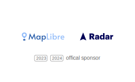

# MapLibre Newsletter - August 2024

We are glad to open the August newsletter with a cordial THANK YOU to [Radar](https://radar.com) for continuing to sponsor MapLibre in 2024!

 
 

## MapLibre Governing Board Election

At the end of August, the MapLibre Governing Board election 2024 took place. The following people have been elected:

- [Yuri Astrakhan](https://github.com/maplibre/maplibre/discussions/375#discussioncomment-10119547) (incumbent, Rivian)
- [Petr Pridal](https://github.com/maplibre/maplibre/discussions/375#discussioncomment-10352676) (incumbent, MapTiler)
- [Luke Seelenbinder](https://github.com/maplibre/maplibre/discussions/375#discussioncomment-10351649) (incumbent, Stadia Maps)
- [Birk Skyum](https://github.com/maplibre/maplibre/discussions/375#discussioncomment-10329544) (incumbent, independent)
- [Haowen You](https://github.com/maplibre/maplibre/discussions/375#discussioncomment-10233553) (new candidate, Amazon)

Congratulations to the new and old Members of the Board!

Read more about the election results [here...](https://maplibre.org/news/2024-08-30-governing-board-election-2024/)

## MapLibre GL JS

Three versions were released this month: [4.5.1](https://github.com/maplibre/maplibre-gl-js/releases/tag/v4.5.1), [4.5.2](https://github.com/maplibre/maplibre-gl-js/releases/tag/v4.5.2), and [4.6.0](https://github.com/maplibre/maplibre-gl-js/releases/tag/v4.6.0).

Among the highlights of these versions are a lot of small bug fixes, better CJKV characters handling and better handling of the camera when terrain is enabled.

The globe branch now supports the custom layer interface and the transform class was split into parts.

Once the globe branch will be merged to main, which should happen in the next month or two, we will start to prepare version 5. You can find a list of anticipated breaking changes [here](https://github.com/maplibre/maplibre-gl-js/issues/3834).

## MapLibre Native

- An initial integration of the Vulkan backend with Android is expected to land soon ([#2711](https://github.com/maplibre/maplibre-native/pull/2711)). We will be releasing an 'Early Access' version of MapLibre Android which will contain only Vulkan support next month (September 2024). This version is not intended to be used in production, but a way to get the Vulkan-based renderer in the hands of the community to get feedback. If you are interested to help testing Vulkan on Android please leave a comment in [this GitHub thread](https://github.com/maplibre/maplibre-native/issues/2787) and we will notify you once the release is out.
- We added back a CMake configuration for Metal builds on macOS. Thanks to this, the Node.js platform is now using the `main` branch again instead of the `opengl-2` branch. A [pre-release for MapLibre Node.js 6.0.0](https://github.com/maplibre/maplibre-native/releases/tag/node-v6.0.0-pre.1) with Metal support on macOS is out, with the full release imminent.
- This is a Public Service Announcement for everyone using **MapLibre iOS with Annotations**. Some users reported [synchronization issues](https://github.com/maplibre/maplibre-native/issues/2522) when panning the map. The issue is only present on devices with ProMotion (120Hz) displays and can be fixed by updating the `Info.plist` for your app (see [Apple documentation](https://developer.apple.com/documentation/quartzcore/optimizing_promotion_refresh_rates_for_iphone_13_pro_and_ipad_pro?language=objc)).
- We started using C++20 this month.
- We forked mapbox-gestures-android and published it as a new package [maplibre-gestures-android](https://github.com/maplibre/maplibre-gestures-android).
- All features of the [MapLibre Style Spec](https://maplibre.org/maplibre-style-spec/) that are supported by MapLibre GL JS but not (yet) by MapLibre Native now have corresponding [tracking issues](https://github.com/maplibre/maplibre-native/issues?q=is%3Aissue+is%3Aopen+label%3Ajs-parity).
- We are using the latest version of the [style spec](https://github.com/maplibre/maplibre-native/blob/main/scripts/style-spec-reference/v8.json) that we share with MapLibre GL JS again. Of course we need to apply a few patches for yet unsupported features.
- [MapLibre Android 11.2.0](https://github.com/maplibre/maplibre-native/releases/tag/android-v11.2.0) was released.
- [MapLibre iOS 6.5.4](https://github.com/maplibre/maplibre-native/releases/tag/ios-v6.5.4) was released.
- At the time of writing, [MapLibre Native](https://github.com/maplibre/maplibre-native) is 10 GitHub stars away from reaching 1000! ⭐

## Maputnik

[Maputnik](https://github.com/maplibre/maputnik), our official style editor, just got a major new ability to be translated to multiple languages. It already supports English, Japanese, Chinese and Hebrew! If you would like to contribute a translation we would appreciate it a lot!

## MapLibre GL Geocoder

The [MapLibre GL Geocoder](https://github.com/maplibre/maplibre-gl-geocoder), our small search component for maplibre-gl-js, got a facelift with the migration to TypeScript, Jest, and TypeDoc.

## Meetings and Events

The next monthly meetings will take place as usual on the second Wednesday of the month, i.e., on Wednesday, September 14th, 2024. The calls are open to everyone, feel free to join and say hi!

- MapLibre Navigation, September 11th, 2024, 6 to 7 PM CEST
- MapLibre Native, September 11th, 2024, 7 to 8 PM CEST
- MapLibre GL JS, September 11th, 2024, 8 to 9 PM CEST

You can find the zoom links for these meetings in the MapLibre Slack channel. Get an automated invite to join the Slack channel now at https://slack.openstreetmap.us/.

There are also some in-person events coming up where you can meet with MapLibre community members:

- [2024 Open Visualization Collaborator Summit](https://github.com/visgl/deck.gl/discussions/8835), 10-11 September 2024, London (UK)
- [FOSS4G BE+NL](https://foss4g.be/nl/), 25-27 September 2024, Baarle (Belgium & the Netherlands)
