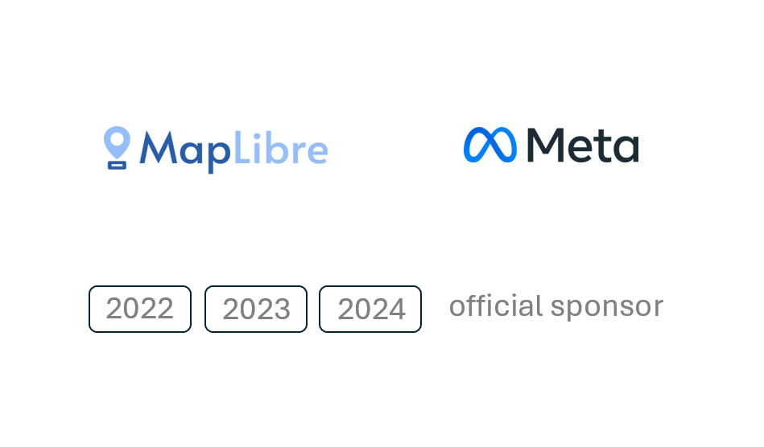

# MapLibre Newsletter - October 2024

We’re delighted to begin the October newsletter with a gracious and hearty Thank You to Meta for their unwavering support as a sponsor of MapLibre in 2024! We look forward to what is to come.

 
 

## MapLibre GL JS

We have released versions 5.0.0-pre.2, 5.0.0-pre.3 and 5.0.0-pre.4 this month.
One interesting feature that was recently added was the support for pitch larger than 90 degrees.

Here's an interesting situation that should be possible now:

 
 

An interesting read on how this works can be found [here](https://github.com/maplibre/maplibre-gl-js/blob/49d7fc96ad883b4e1042fe305cd0c0a16ccd9732/developer-guides/center-point.md).

We have introduced some breaking changes in these versions as was planned for version 5, so make sure to take a look at the changelog for more details.
There are still open issues with globe and other improvements we plan to add as part of this major release. Stay tuned!
See the [initial post](https://github.com/maplibre/maplibre-gl-js/issues/3834) in the following issue to see the current status.

Overall we are progressing well and ironing out the globe feature.

## MapLibre Native

- Development of the Vulkan backend continued this month. We also ran another benchmark on AWS Device Farm, using even more device types this time. One conclusion you may draw from the [results](https://github.com/maplibre/maplibre-native/issues/2787#issuecomment-2432251912) is that Vulkan will offer a solid performance boost on modern devices. We're still validating these results. Stay tuned for an Android official release following later this year!
- Kaushal Kumar Singh rewrote the Android build config from Groovy to the more modern Kotlin in [#2902](https://github.com/maplibre/maplibre-native/pull/2902).
- Support for [`text-variable-anchor-offset`](https://maplibre.org/maplibre-style-spec/layers/#text-variable-anchor-offset) has been merged ([#2921](https://github.com/maplibre/maplibre-native/pull/2921)). This feature is one of the features that Microsoft championed to be added to MapLibre GL JS, and now ported to MapLibre Native. We're happy with this contribution and are excited about Microsoft adopting MapLibre Native.
- MapLibre iOS [6.7.1 and 6.8.0](https://github.com/maplibre/maplibre-native/releases?q=ios&expanded=true) were released.
- MapLibre Android [11.5.1](https://github.com/maplibre/maplibre-native/releases?q=android-v11&expanded=true) was released.
- We also made two releases for [MapLibre Android v10](https://github.com/maplibre/maplibre-native/releases?q=android-v10&expanded=true) with some backports.

## Flutter

[@josxha](https://github.com/josxha) is conducting a brief survey to gather feedback on MapLibre Flutter. The survey takes only about 2 minutes to complete and will help to identify strengths and areas for improvement. If you've worked with MapLibre on Flutter, your input is highly appreciated.
You can participate [here](https://forms.gle/UTB6KjVFtmYv2RzU8).

## Conferences

Check out these events to attend:

- [FOSS4G 2024 in Belem, Brazil](https://2024.foss4g.org/en/)
- [FOSSGIS 2025 in Münster, Germany](https://fossgis-konferenz.de/2025/programm/)
- [State of the Map Asia 2024, Bangladesh](https://stateofthemap.asia/)

## Meetings and Events

The upcoming monthly meetings will be held as usual on the second Wednesday of the month. These calls are open to everyone, and we encourage you to join us and say hello!

- MapLibre Navigation: November 13th, 2024, 6:00–7:00 PM CET
- MapLibre Native: November 13th, 2024, 7:00–8:00 PM CET
- MapLibre GL JS: November 13th, 2024, 8:00–9:00 PM CET

Zoom links for these meetings can be found in the MapLibre Slack channel. If you’re not already a member, you can easily join by getting an automated invite at https://slack.openstreetmap.us/.

## Developer Connection with MapLibre Board

We are excited to introduce an option to connect one-to-one with a member of the MapLibre Board. Our board boasts various backgrounds, experiences and executive level leadership. We invite you to connect to share your ideas for building the MapLibre project.

- [Sign-Up for a 1-1 Developer Connection with MapLibre Board](https://forms.gle/tSEPUKi98i8fTCP59)
