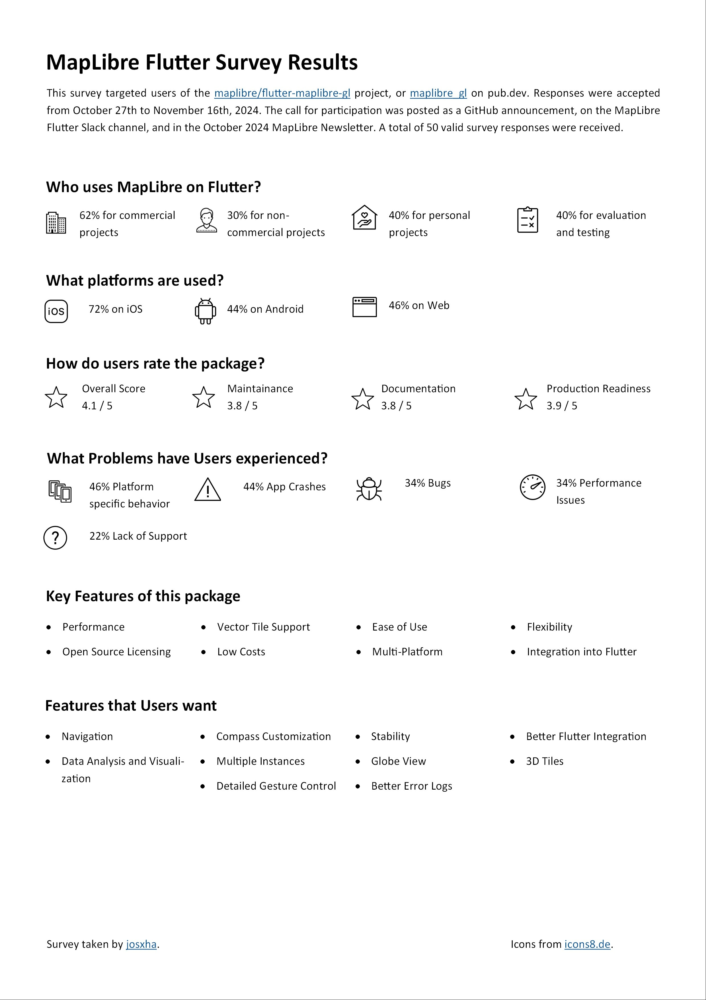

November month has seen a lot of updates from across different proejcts in Maplibre ecosystem. From ulitple pre-releases for MapLibre GL JS and to groundbreaking udpates in Maplibre Native, there's a lot to explore.

In addition, a recent survey shed light on user feedback for flutter Maplibre GL. Don't forget to check upcoming map events and join us for the monthly meetings to stay connected with the community.

Let's dive in!

## MapLibre GL JS

We have released versions [5.0.0-pre.5](https://github.com/maplibre/maplibre-gl-js/releases/tag/v5.0.0-pre.5), [5.0.0-pre.6](https://github.com/maplibre/maplibre-gl-js/releases/tag/v5.0.0-pre.6), [5.0.0-pre.7](https://github.com/maplibre/maplibre-gl-js/releases/tag/v5.0.0-pre.7) and [5.0.0-pre.8](https://github.com/maplibre/maplibre-gl-js/releases/tag/v5.0.0-pre.8) this month!
These pre-release versions introduced most of the breaking changes we have planned for the version 5.

For other features we thought about introducing as a breaking change, we found a solution that does not require a breaking change and we'll see if and when they will be introduced in the future.

We have solved all the showstopper bugs for this release and there's only a few minor things we would like to include before creating a production ready version. To see the current status of version 5 you can follow the initial post in the following issue:

- https://github.com/maplibre/maplibre-gl-js/issues/3834

## MapLibre Native

- MapLibre Android [11.6.0](https://github.com/maplibre/maplibre-native/releases/tag/android-v11.6.0) and [11.6.1](https://github.com/maplibre/maplibre-native/releases/tag/android-v11.6.1) have been released.
- MapLibre iOS [6.8.1](https://github.com/maplibre/maplibre-native/releases/tag/ios-v6.8.1) was released.
- We created a new documentation site to host [MapLibre Android Examples](https://maplibre.org/maplibre-native/android/examples/). This provides a more accessible resource compared to the [API Documentation](https://maplibre.org/maplibre-native/android/api/). More examples are underway, contributions are of course welcomed.
- [Flitsmeister](https://www.flitsmeister.nl/) has released a sample project demonstrating how to use MapLibre Android with **Android Auto**: [GitHub Repo](https://github.com/flitsmeister/MapLibre-Android-Auto-Sample). We're thrilled to see Flitsmeister share their hard-earned expertise with the community. It's also exciting to see the FOSS magic at work, with suggestions for improvements already coming from other members of the community.
- We're experimenting with some new GitHub functionality: [issue templates and issue types](https://github.com/maplibre/maplibre-native/discussions/3053).
- Engineers working for [HudHud](https://hudhud.sa/en) have kicked off the development of brining **3D Model Support** to MapLibre Native. To implement this properly we need to "revive the 3D pass" (which is currently unused), which brings about plenty of complexities. It will be a while until proper 3D support will land, but watch this space, and join the monthly meetings, if you are interested in this.

### Vulkan

We’ve made a **pre-release** of MapLibre Android with **Vulkan support**: [11.6.1-vulkan-pre1](https://github.com/maplibre/maplibre-native/releases/tag/android-v11.6.1-vulkan-pre1). This will likely be the last pre-release, with the official Vulkan-supported release planned for release in early December.

While OpenGL ES will remain supported and MapLibre Android releases with OpenGL ES will continue for the foreseeable future, Vulkan offers a more modern and performant backend.

#### Feedback Needed!

Help us test Vulkan support and ensure there are no regressions for your app by following these steps:

1. Use the dependency: `org.maplibre.gl:android-sdk:11.6.1-vulkan-pre1`.
2. Test your styles:
   - Verify they render correctly across various zoom levels, pitches, and feature-dense areas.
   - Rotate the device and check for any issues.
   - Ensure there are no performance regressions.
   - Test runtime styling, especially if it’s user-driven.
3. Share your feedback! You can contribute to the [pre-release thread](https://github.com/maplibre/maplibre-native/issues/2787) or [create an issue](https://github.com/maplibre/maplibre-native/issues/new?template=android-bug-report.yml). Positive feedback is welcome, too!

## Flutter MapLibre GL

The survey conducted last month found that users appreciate MapLibre on Flutter and rate the flutter-maplibre-gl package with **4.1 out of 5 stars overall**. The package is praised for its performance, lower cost and integration with Flutter, among other things.
Stability and platform differences were identified as issues, as 46% of users reported have been affected by platform-specific behavior and 44% of users experienced crashes.

 

## Navigation Android

Maplibre-Navigation-Android has been updated to use the latest Maplibre-Native release 11.6.1 and was released as version 4.0.0 with this version. You can find more information about this in the following PR:

- https://github.com/maplibre/maplibre-navigation-android/pull/110

## Conferences

Check out these events to attend:

- [FOSS4G 2024 in Belem, Brazil](https://2024.foss4g.org/en/) between 02nd-08th December
- [FOSS4G Asia 2024 in Bangkok, Thailand](https://foss4g.asia/2024/) between 15th-18th December

## Community Events

**_MapLibre Meetup Japan #03 @ Tokyo_** was held on November 8th, hosted by the MapLibre User Group Japan (MUG-JP). This event marked the group’s first in-person gathering and saw an impressive turnout of nearly 40 users. The meetup provided a fantastic opportunity to share knowledge and raise awareness about MapLibre.

A huge thank you to everyone who participated and supported this event! We look forward to more such community engagements in the future. For more details about the event, check out the MapLibre [Slack conversation](https://osmus.slack.com/archives/C01G3D28DAB/p1731329007263679).

## Monthly Meetings

The upcoming monthly meetings will be held as usual on the second Wednesday of the month. These calls are open to everyone, and we encourage you to join us and say hello!

- MapLibre Navigation: December 11th, 2024, 6:00–7:00 PM CET
- MapLibre Native: December 11th, 2024, 7:00–8:00 PM CET
- MapLibre GL JS: December 11th, 2024, 8:00–9:00 PM CET

Zoom links for these meetings can be found in the MapLibre Slack channel. If you’re not already a member, you can easily join by getting an automated invite at https://slack.openstreetmap.us/.
