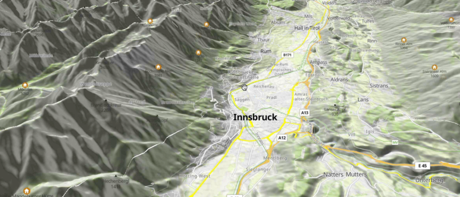
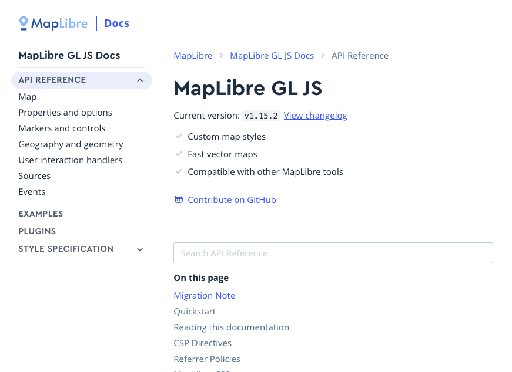
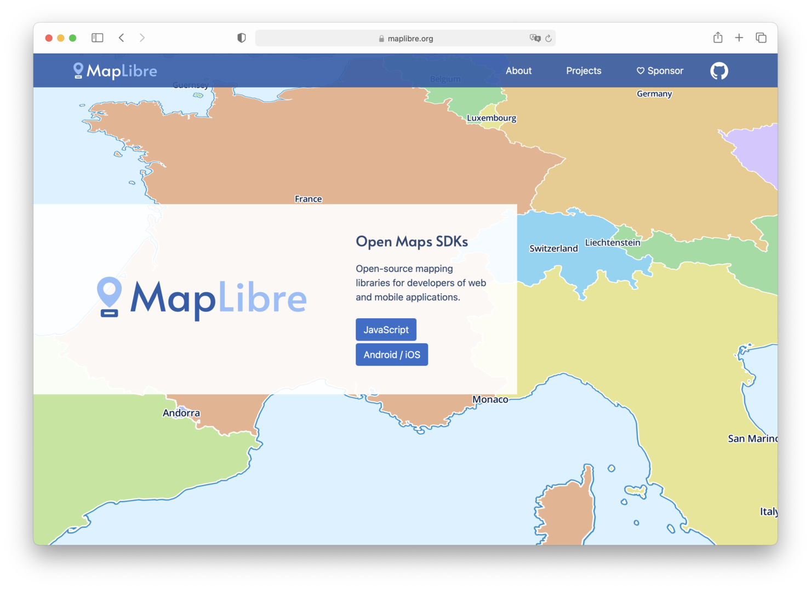

<!-- ---
title: Roadmap
weight: 10
---

<b>Bounties:</b> Some projects on our Roadmap have Bounties, i.e., you can get paid for working on them. 
<a class="btn btn-primary" href="step-by-step-bounties-guide">Read Step-by-Step Bounties Guide...</a>  

<h2>Under Consideration</h2>

You can propose strategic cross-project directions in this [GitHub Discussion](https://github.com/maplibre/maplibre/discussions/categories/bounties-cross-project-directions). The MapLibre Governing Board determines which projects are on the roadmap and is thankful for all input!

<h2>In Progress</h2>

  

    

      
      

        <h5 class="card-title">Metal</h5>
        <a href="metal/" class="btn btn-primary">Read more...</a>
      

    

  

  

    

      
      

        <h5 class="card-title">Terrain3D Improvements</h5>
        <a href="terrain3d-improvements/" class="btn btn-primary">Read more...</a>
        <a href="https://github.com/maplibre/maplibre/issues/189" class="btn btn-light">💰 Bounties</a>
      

    

  

  

    

      
      

        <h5 class="card-title">Globe View</h5>
        <a href="globe-view/" class="btn btn-primary">Read more...</a>
        <a href="https://github.com/maplibre/maplibre/issues/190" class="btn btn-light">💰 Bounties</a>
      

    

  

  

    

      
      

        <h5 class="card-title">Documentation</h5>
        <a href="documentation/" class="btn btn-primary">Read more...</a>
        <a href="https://github.com/maplibre/maplibre/issues/191" class="btn btn-light">💰 Bounties</a>
      

    

  

  

    

      
      

        <h5 class="card-title">Writing Systems</h5>
        <a href="writing-systems/" class="btn btn-primary">Read more...</a>
        <a href="https://github.com/maplibre/maplibre/issues/193" class="btn btn-light">💰 Bounties</a>
      

    

  

  

    

      
      

        <h5 class="card-title">Performance</h5>
        <a href="performance/" class="btn btn-primary">Read more...</a>
        <a href="https://github.com/maplibre/maplibre/issues/192" class="btn btn-light">💰 Bounties</a>
      

    

  

  

    

      
      

        <h5 class="card-title">MapLibre Innovation Lab</h5>
        <a href="maplibre-innovation-lab/" class="btn btn-primary">Read more...</a>
        <a href="https://github.com/maplibre/maplibre/issues/194" class="btn btn-light">💰 Bounties</a>
      

    

  

  

    

      
      

        <h5 class="card-title">Blending Modes</h5>
        <a href="blending-modes/" class="btn btn-primary">Read more...</a>
        <a href="https://github.com/maplibre/maplibre/issues/269" class="btn btn-light">💰 Bounties</a>
      

    

  

  

    

      
      

        <h5 class="card-title">Modernize Codebase</h5>
        <a href="modernize-codebase/" class="btn btn-primary">Read more...</a>
        <a href="https://github.com/maplibre/maplibre/issues/270" class="btn btn-light">💰 Bounties</a>
      

    

  

  

    

      
      

        <h5 class="card-title">SVG Symbol Source</h5>
        <a href="svg-symbol-source/" class="btn btn-primary">Read more...</a>
        <a href="https://github.com/maplibre/maplibre/issues/271" class="btn btn-light">💰 Bounties</a>
      

    

  

  

    

      
      

        <h5 class="card-title">Non-Mercator Projection</h5>
        <a href="non-mercator-projection/" class="btn btn-primary">Read more...</a>
        <a href="https://github.com/maplibre/maplibre/issues/272" class="btn btn-light">💰 Bounties</a>
      

    

  

  

    

      
      

        <h5 class="card-title">Leightweight Renderers</h5>
        <a href="leightweight-renderers/" class="btn btn-primary">Read more...</a>
        <a href="https://github.com/maplibre/maplibre/issues/273" class="btn btn-light">💰 Bounties</a>
      

    

  

<h2>Released</h2>

  

    

      
      

        <h5 class="card-title">Terrain3D</h5>
        <a href="terrain3d/" class="btn btn-primary">Read more...</a>
      

    

  

  

    

      
      

        <h5 class="card-title">Community & Governance</h5>
        <a href="community-governance/" class="btn btn-primary">Read more...</a>
      

    

  

  

    

      
      

        <h5 class="card-title">iOS and Android SDK Release</h5>
        <a href="ios-android-release/" class="btn btn-primary">Read more...</a>
      

    

  

  

    

      
      

        <h5 class="card-title">JS Documentation Website</h5>
        <a href="js-docs/" class="btn btn-primary">Read more...</a>
      

    

  

  

    

      
      

        <h5 class="card-title">TypeScript</h5>
        <a href="typescript/" class="btn btn-primary">Read more...</a>
      

    

  

  

    

      
      

        <h5 class="card-title">Project Website</h5>
        <a href="project-website/" class="btn btn-primary">Read more...</a>
      

    

  

 -->
