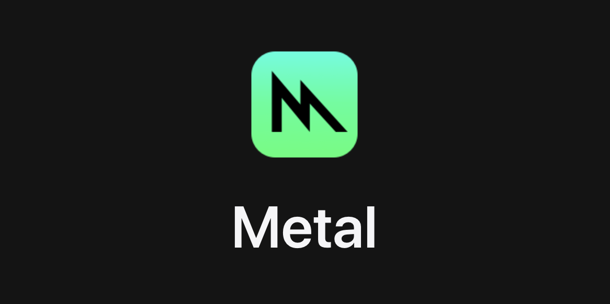

Implement a Metal graphics backend to ensure iOS in future releases is fully supported, as Apple is deprecating OpenGL.

    

First, the codebase shall be modularized to prepare the existing OpenGL architecture for a more modern graphics backend like Metal. Once the renderer is modularized, we will proceed with implementing the actual Metal redering backend.

Read the Design Proposals on GitHub:

- [2022-10-27-rendering-modularization.md](https://github.com/maplibre/maplibre-native/blob/main/design-proposals/2022-10-27-rendering-modularization.md)
- [2022-11-29-metal-port.md](https://github.com/maplibre/maplibre-native/blob/main/design-proposals/2022-11-29-metal-port.md)

Refer to the [MapLibre Native Metal Project Board](https://github.com/orgs/maplibre/projects/8) on GitHub for the most up-to-date status.

## Status (2023-09-05)

The rendering modularization effort is now mostly [complete](https://github.com/maplibre/maplibre-native/issues/1389). The new renderer can be enabled with a feature flag, the legacy renderer is still the default at this point. The new render will continue to receive stability and [performance](https://github.com/maplibre/maplibre-native/issues/1548) upgrades and will be 'field tested' by various stakeholders before it will become the default.

Now that the architectural changes have been completed, the focus of the team has shifted to implementing a Metal renderer. The new architecture seems to be paying off, because they have produced a working Metal renderer in lightning speed. The first adventurous [alpha testers](https://github.com/maplibre/maplibre-native/issues/1609) of Metal support in MapLibre Native can get their hands on it sometime in September 2023.

## Status (2023-03-24)

The Metal project team has started working with the goal of delivering a Metal beta release by the end of 2023. AWS and Meta are supporting this initiative.

## Status (2023-05-21)

The Metal project is ongoing. Below are the updates:

- All team members are now onboarded
- Project Phase 1: Rendering Modularisation is underway with the goal of reaching a stable phase that will allow a pre-release, before going full steam on Metal implementation.
