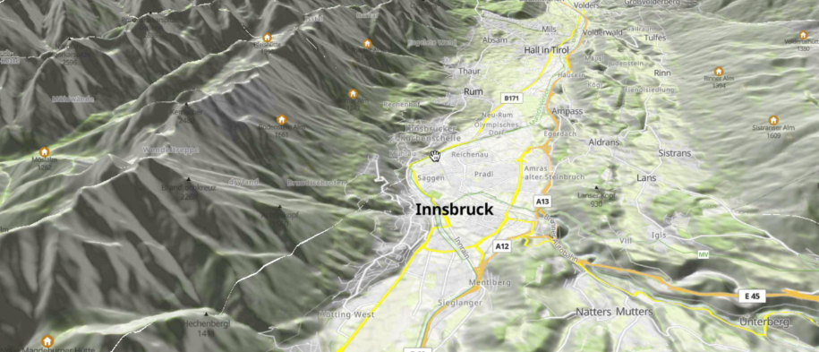

Goals:

- 3D terrain visualization and parity web - native
- Visualization of the elevation from DEM (RGBA tiles) including drawing the tracks, labels and points.
- Improvements related to 3d terrain rendering - improvements and bug-fixing in existing Web implementation, implementation in Native, documentation.

    

GitHub Tracking Issue (💰 Bounties): https://github.com/maplibre/maplibre/issues/189

Bounty Proposal Discussion: https://github.com/maplibre/maplibre/discussions/158

Bounty Direction budget: USD 10,000
