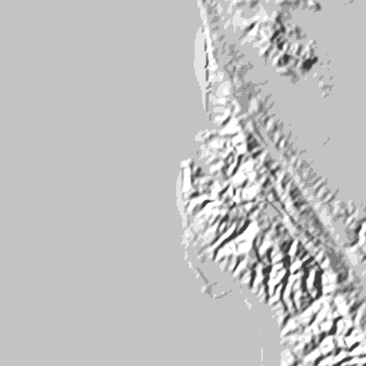
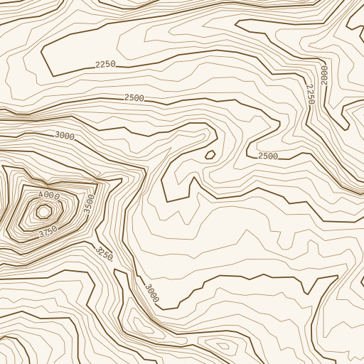

import { Image } from "astro:assets";
import radarLogo from "/public/img/radar-logo.svg";
import maplibreLogo from "/public/img/maplibre-logos/maplibre-logo-for-light-bg.svg";
import globeNative from "./native-globe.png";
import flutterDocsite from "./flutter.gif";
import martinHillshade from "./martin-hillshade.webp";
import martinContour from "./martin-contour.webp";
import ReleaseTable from "../../../components/ReleaseTable.astro";
import Announcement from "../../../components/Announcement.astro";
import ContributorGrid from "../../../components/ContributorGrid.astro";
import "../../../styles/img-compare.scss";

Welcome to the August 2026 edition of the MapLibre Newsletter!

From the rapid release cadence of MapLibre GL JS and exciting update about Globe in Native, to Martin's new hillshade and contour postprocessing, development velocity is at an all-time high.

Before getting further into project updates, a special shout goes to [Radar](https://www.radar.com/), for their unwavering partnership since 2023. Sustained backing, from organizations and individuals alike, keeps us moving forward. If you'd like to help sustain MapLibre’s ongoing work, learn more on our [Sponsors page](https://maplibre.org/sponsors/).

  

    <Image
      src={maplibreLogo}
      alt="MapLibre logo"
      style={{
        height: "50px", 
        width: "auto",
        objectFit: "contain",
      }}
    />
    <Image
      src={radarLogo}
      alt="Radar logo"
      style={{
        height: "55px",
        width: "auto",
        objectFit: "contain",
      }}
    />
  

  

  Thank you, Radar, for supporting us consistently since 2023 💙 
  

## 🏛️ Board & Team Updates

- 2026 Elections: Voting member nominations and [board elections](https://github.com/maplibre/maplibre/issues/508) ran throughout August. Stay tuned for a detailed blog post coming soon summarizing the election results!
- Team Growth: [Birk Skyum](https://maplibre.org/about/birk-skyum/), who has long served on our board and made consistent contributions to our codebase, is now joining our team as a Graphics Engineer!

## 📱 MapLibre Native

New features and improvements in MapLibre Native this month include:

- A PR with a promising globe implementation was opened. See the [behemoth of a PR](https://github.com/maplibre/maplibre-native/pull/4533) with no less than 30.000 lines of code. This is quite exciting, as globe mode is one of the [most requested features](https://github.com/maplibre/maplibre-native/issues/3161) of MapLibre Native. Stay tuned for pre-releases so you can help with quality control. Reviews are also welcome.

  

    <Image
      src={globeNative}
      alt="Native rounded corners for fill extrusions"
      style={{
        width: "100%",
        height: "auto",
        display: "block",
        borderRadius: "6px",
      }}
      loading="lazy"
      decoding="async"
    />
  

  

    <em style={{ fontSize: "0.9rem", color: "#8b949e", fontStyle: "italic" }}>
      John Carmack's globe implementation. It will probably take a while until it lands, because this is quite a big feature requiring careful review and testing. Map style based on OpenMapTiles and data from OpenStreetMap.

    </em>

  

- Another quite large (LLM assisted) PR implements the `global-state` expression that was implemented earlier in MapLibre GL JS. This functionality makes it possible to define 'variables' for a style that you can use in various expressions. See [#4516](https://github.com/maplibre/maplibre-native/pull/4516) for the PR which was submitted by Taiyu Yoshizawa from [our valued sponsor MIERUNE](https://www.mierune.co.jp/en). Reviews welcome!

- Stephan Schmid from Mercedes Benz made string expressions operate on Unicode, see [#4344](https://github.com/maplibre/maplibre-native/pull/4344).

- Vladyslav Odobesku from Intellias implemented a `CustomVectorSource` in [#4377](https://github.com/maplibre/maplibre-native/pull/4377). This provides a more efficient way to load vector data when using MapLibre Android, since you can load it as binary data (in MVT format).

- [@munawiki](https://github.com/munawiki) implemented `split` and `join` style spec expressions in [#4463](https://github.com/maplibre/maplibre-native/pull/4463).

- Yaroslav Zarichnyi from Lyft implemented a [customizable gradient for fill extrusions](https://github.com/maplibre/maplibre-native/pull/4488). Please give feedback on the [related style spec change](https://github.com/maplibre/maplibre-style-spec/issues/1795).

- Bart Louwers is hacking on a [C plugin API](https://github.com/maplibre/maplibre-native/pull/4475) for MapLibre Native. There is also a template repository with some [example plugins](https://github.com/louwers/maplibre-native-plugin-template/tree/main/plugins). The idea is that you will be able to fork this repository to easily create and release your own plugins. The current examples cover a rectangle layer, a layer that loads GLTF models and the core hillshade and heatmap layers implemented as a plugins(_in the future, we might want to exclude lesser-used core layers and require people to load those as plugins to keep the core small, though we would need to ensure that plugins loaded this way do not introduce regressions_). There is also a plugin for adding shadows to fill extrusions. Please share your ideas for plugins so we can use this for shaping the plugin API.

- We moved the namespaces and include paths from `mbgl` to `mln`. Because we don't consider the C++ API to be stable, we do not consider this a breaking change for the platforms. For in-flight work we have included some scripts in [#4487](https://github.com/maplibre/maplibre-native/pull/4487) and [#4511](https://github.com/maplibre/maplibre-native/pull/4511)

## 🌐 MapLibre GL JS

Six (!) versions were released this month:
[6.2.0](https://github.com/maplibre/maplibre-gl-js/releases#release-v6.2.0),
[6.3.0](https://github.com/maplibre/maplibre-gl-js/releases#release-v6.3.0),
[6.4.0](https://github.com/maplibre/maplibre-gl-js/releases#release-v6.4.0),
[6.4.1](https://github.com/maplibre/maplibre-gl-js/releases#release-v6.4.1),
[6.5.0](https://github.com/maplibre/maplibre-gl-js/releases#release-v6.5.0),
[6.6.0](https://github.com/maplibre/maplibre-gl-js/releases#release-v6.6.0),
with two new style spec properties among them.

<Announcement>
  

    📣 Increased release frequency is a consequence of the improved quality of
    the AI code generation and people actively opening PRs to solve problems
    that were a lot harder to solve due to steep learning curve. It's worth
    mentioning that this causes delays in PR reviews due to higher volume of
    PRs. We hope to address this going forward, and we appreciate your patience
    as we work through the review queue.
  

</Announcement>

- [`fill-extrusion-rounded-corner-distance`](https://maplibre.org/maplibre-gl-js/docs/examples/fill-extrusion-rounded-corners/) arrived in GL JS in v6.2.0, following last month's Native-first landing, which allows you to draw rounded corners for buildings.
- [`symbol-height-offset`](https://maplibre.org/maplibre-gl-js/docs/examples/elevate-symbols-above-the-terrain/) and `symbol-height-anchor` were added to allow raising icons and text above the map. This feature was discussed in the last two monthly meetings and after the spec matured, it is now available for your use cases, such as icons on top of building or drones in the sky.
- There were also a few features related to improved icon animation by rendering on the GPU, as well as the ability to keep the perspective or flat warp in image sources.
- Going forward we intend to close the last gap between native and web by supporting the `font-faces` style spec definition and improving complex scripts support. It's ready for review and you can test it out via the [#8237](https://github.com/maplibre/maplibre-gl-js/pull/8237) PR.
- There's also a strong momentum for supporting some basic cases related to projection and custom CRS that started here in [#8236](https://github.com/maplibre/maplibre-gl-js/pull/8236) and is expected to continue next month.

🙏 Thanks to all the contributors this month! It's great to see so many features and bug fixes arriving. Keep up the good work!

<ContributorGrid
  contributors={[
    "CommanderStorm",
    "mondsichtung",
    "johncarmack1984",
    "DoFabien",
    "jcolot",
    "lucaswoj",
    "smmariquit",
    "pholmstr",
    "StrawberryJam22",
    "tnikkel",
    "Alchez",
    "0xKirisame",
    "birkskyum",
    "clement-igonet",
    "i4innovationnet",
    "samuel-git",
    "smvjohansenbouvet",
    "zdila",
  ]}
/>

## 🦀 Martin

[Martin](https://maplibre.org/martin/), the MapLibre tile server, shipped two releases in
August (see 1.14.0 and 1.15.0 in the [changelog](https://github.com/maplibre/martin/blob/main/martin/CHANGELOG.md)):

The major features were:

- **Hillshade postprocessing.** Martin can now bake shaded relief from a source serving Mapzen
  normal tiles, so clients get hillshade instead of a normal map they have to shade themselves.
  [Docs](https://maplibre.org/martin/postprocessing/hillshade/), [PR](https://github.com/maplibre/martin/pull/3180)
- **Contour postprocessing.** `convert_to_contour` traces contour lines out of Terrarium elevation
  tiles and serves them as MVT, tagged with elevation and whether the line is a major one, with the
  interval configurable per zoom. Output is vector, so the client styles and labels the lines.
  [Docs](https://maplibre.org/martin/postprocessing/contour/), [PR](https://github.com/maplibre/martin/pull/3183)

> [!IMPORTANT]
> **Two security advisories** (our first) **were fixed** in 1.14.0. As always, **we recomend** to **update**.
> Out-of-gamut CIE colors in a static-overlay body
> could permanently kill render workers ([GHSA-6774-6cqw-f586](https://github.com/maplibre/martin/security/advisories/GHSA-6774-6cqw-f586),
> affects only the opt-in `rendering` feature), and repeated sprite ids let a single
> unauthenticated request amplify the work required
> ([GHSA-5x5g-6p4c-jqfh](https://github.com/maplibre/martin/security/advisories/GHSA-5x5g-6p4c-jqfh), medium).

Images of how hillshade/contour look:

<table class="img-compare">
<tr>
<td align="center">

_Hillshade_

</td>
<td align="center">

_Contour_

</td>
</tr>
</table>

## 🤖 Maplibre Agent Skills

MapLibre Agent Skills is a collection of agent skills, markdown files an AI coding assistant loads as context, that teach assistants to write correct MapLibre code. With help from a new contributor ([@johncarmack1984](https://github.com/johncarmack1984)), the project has matured to the point where we are ready for you all to really kick the tires. The project published [v0.2.0](https://github.com/maplibre/maplibre-agent-skills/releases/tag/v0.2.0) this month. The release:

- adds `maplibre-v6-migration`, covering the breaking changes in MapLibre GL JS v6 most likely to trip up coding agents.
- adds `maplibre-source-wiring`, split out of `maplibre-tile-sources`, for the cases where a source is configured but nothing draws.
- adds a release watch that files an issue when an upstream MapLibre release removes, renames, or deprecates something a skill still mentions.

Nine skills now span cartography, tile sources, PMTiles, terrain rendering, fonts and glyphs, and Mapbox and v6 migration, plus a process skill for turning a research or coding session into a new skill.

Skills are backed by a committed baseline run of prompt injections showing the model failing without the skill. Install the set with `npx skills add maplibre/maplibre-agent-skills`, and if your assistant still gets MapLibre stuff wrong, [file a failure report](https://github.com/maplibre/maplibre-agent-skills/issues/new?template=ai-failure-report.md).

## 🪶 MapLibre Flutter

[`flutter-maplibre-gl`](https://github.com/maplibre/flutter-maplibre-gl) has shipped [v0.27.0](https://pub.dev/packages/maplibre_gl)!

After [0.26.0](https://maplibre.org/news/2026-05-02-maplibre-newsletter-april-2026/) tackled years of accumulated backlog, this release focuses on making the package easier to use, more consistent across platforms, and closer to the current MapLibre ecosystem.

  

    <Image
      src={flutterDocsite}
      alt="The new Flutter MapLibre documentation site"
      style={{
        width: "100%",
        height: "auto",
        display: "block",
        borderRadius: "6px",
      }}
      loading="lazy"
      decoding="async"
    />
  

  

    <em style={{ fontSize: "0.9rem", color: "#8b949e", fontStyle: "italic" }}>
      The new documentation site: every guide comes with a live, interactive map.
      [Documentation](https://maplibre.org/flutter-maplibre-gl/) | [Migration Guide](https://maplibre.org/flutter-maplibre-gl/migration/) | [Full changelog](https://pub.dev/packages/maplibre_gl/changelog) | [Package](https://pub.dev/packages/maplibre_gl)

    </em>

  

**Highlights:**

- **Interactive documentation site:** [maplibre.org/flutter-maplibre-gl](https://maplibre.org/flutter-maplibre-gl/) now provides practical guides across the API, with live examples you can explore directly in the browser.

- **Alignment with MapLibre Style Spec:** the plugin's style APIs are now generated from the current upstream spec instead of an outdated snapshot, thereby bringing new properties and expressions.

- **Platform parity:** a growing part of the API now behaves consistently across Android, iOS, and Web, including features like cluster inspection, feature state, map padding, among many others.

- **Web upgrades:** The web platform now uses MapLibre GL JS 6.4.1, adding support for globe, terrain, sky, and colour relief.

- **Faster maps:** Engine pre-warming cuts startup times, and large GeoJSON updates run without blocking the UI.

- **Resilient Android apps:** Maps now correctly recover and preserve camera position during activity recreation.

Together, these changes move `flutter-maplibre-gl` closer to its goal of providing a **consistent MapLibre experience across Android, iOS, and Web**, while making the package easier to learn and more pleasant to use.

<Announcement>
  

    📣 Monthly downloads have grown from around **20,000 in August 2025 to more
    than 80,000 today**, roughly a **4× increase in one year**. 
    
    🙏 Thanks to everyone who contributed to this release and helped make MapLibre Flutter more capable, consistent, and accessible!

  

</Announcement>

## ✨ Community Spotlight

### MapLibre GL JS Ecosystem Adoption

MapLibre GL JS has recently seen notable adoption across the wider mapping ecosystem. The following are four prominent FOSS projects I've recently worked with to enhance their support for MapLibre:

- **[deck.gl](https://deck.gl/)**, a geospatial visualization framework, now has a dedicated `MapLibreOverlay` in the `deck.gl` package. For MapLibre users, this new first-party solution replaces the reliance on `MapboxOverlay` and builds directly on MapLibre's public APIs and types. As the Mapbox and MapLibre renderers diverge, this will help maintain a high level of compatibility. [PR](https://github.com/visgl/deck.gl/pull/10566/)

- **[Placemark.io](https://www.placemark.io/)**, a geospatial data editor, has replaced Mapbox GL JS with MapLibre GL JS 6, removing its remaining Mapbox dependency and making the project fully open source. The migration also moves to OpenFreeMap and provider-neutral routing. Thanks to Birk for the migration! [Write-up](https://macwright.com/2026/08/25/placemark-fully-open-source) · [PR](https://github.com/placemark/placemark/pull/269)

- **[Apache Superset](https://superset.apache.org/)**, a data exploration and visualization platform, has added MapLibre support across its geospatial charts, with new charts defaulting to MapLibre and open basemaps that require no API key. The change will be released in Superset 6.2.0, while Mapbox remains available for backwards compatibility. [PR](https://github.com/apache/superset/pull/38035)

- **[Home Assistant](https://www.home-assistant.io/)**, a home automation platform, has moved its default basemap from CARTO raster tiles to OpenStreetMap vector tiles rendered with MapLibre GL JS through `maplibre-gl-leaflet`, while continuing to use Leaflet for map interactions. [PR](https://github.com/home-assistant/frontend/pull/53816)

### Expressive

Built by Zbigniew Matysek ([@falseinput](https://github.com/falseinput)), Expressive is a language that compiles to MapLibre style JSON and is tailor-made for maintaining base map styles.

- It lets you split styles across files, name colors and widths once, derive one value from another, and write expressions in a readable syntax.
- Because every style JSON is already a valid Expressive file, existing styles can be rewritten piece by piece.
- Checkout the [source code](https://github.com/falseinput/expressive) or [interactive demo](https://falseinput.github.io/expressive), which runs the [OpenFreeMap Bright style rebuilt in Expressive](https://github.com/falseinput/openfreemap-expressive) with 119 layers driven by 15 parameters, recompiling live in your browser.

## 👥 Conferences & Events

Last month was packed with conference attendance across State of the Map (SOTM) Paris and FOSS4G 2026!
You can explore the full schedule of talks and sessions in our [MapLibre SOTM & FOSS4G Gist](https://gist.github.com/ramyaragupathy/11d485fc584a1643315a3d0620d7b2f8).

Key talks and recordings from SOTM Paris include:

- [Interview from Yuri Astrakhan on MapLibre](https://peertube.openstreetmap.fr/w/sAGbbenarV6zNfoQw6wxdZ)
- [Being a Maintainer in the Age of LLMs by Bart Louwers](https://peertube.openstreetmap.fr/w/jFTWB2taYjE5S2qgSUBH3E)
- [MapLibre from data to rendering in one status update by Frank Elsinga](https://peertube.openstreetmap.fr/w/rELhPoARds7WuZUJtMbRCm)

## 🗓️ Monthly meetings

We continue our regular community calls on the _**second Wednesday**_ of each month, with an additional session on the last Wednesday to better accommodate Asia/Oceania time zones.

Upcoming Calls

- MapLibre Native: Sep 09, 2026 – 7:00–8:00 PM Berlin Time (UTC+2)
- MapLibre GL JS: Sep 09, 2026 – 8:00–9:00 PM Berlin Time (UTC+2)

🌏 MapLibre Eastern Call

Held on the last Wednesday of the month at an Asia/Oceania-friendly hour:

- Sep 30, 2026 – 9–10:00 AM UTC

All calls are open to everyone. Zoom links are shared in the MapLibre Slack.
Not yet a member? Request an invite via the [OpenStreetMap US Slack](https://slack.openstreetmap.us/) and join the `#maplibre` channel.
We’d love to see you there!
